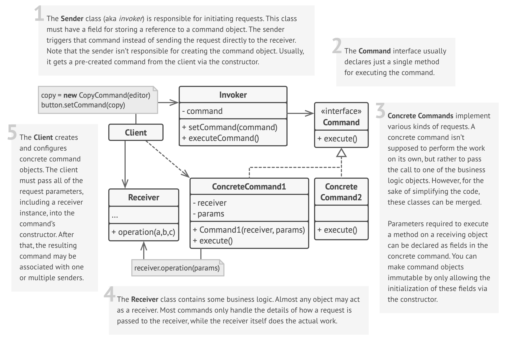

# Command Design Pattern

## Definition

Imagine you have a universal remote control 📺 for your smart home devices:

- **Turn Light On** 💡  
- **Turn Light Off** 🚫  
- **Increase Volume** 🔊  
- **Decrease Volume** 🔉  

Each button press represents a specific request or command. You (the **Client**) configure which button triggers which action. When you press a button (the **Invoker**), it sends the command object (e.g., `LightOnCommand`) to be executed. The remote doesn't need to know how the light turns on; it just holds and triggers the command. The command object itself knows which device (the **Receiver**, e.g., the specific light bulb) to act upon and what method to call (e.g., `turn_on()`).

Relating to the pattern:

- **You (the Customer)** → Client  
- **Waiter** → Invoker  
- **Order Slip (with "Prepare Pizza" instruction)** → Command Object  
- **Chef** → Receiver  
- **Placing the order** → Creating & queuing a command  
- **Chef making the pizza** → Executing the command  

The **Command Pattern** is a behavioral design pattern that turns a request into a stand-alone object containing all information about the request. This transformation lets you parameterize methods with different requests, delay or queue a request's execution, and support undoable operations.  

## Structure



### Main Components

- **Command Interface** — Declares an interface, usually with a single `execute()` method (and optionally `undo()`).
- **Concrete Command** — Implements the `Command` interface. Knows about the  `Receiver` and invokes a method on the `Receiver`. Stores parameters needed by the `Receiver`.
- **Receiver** — Knows how to perform the operations associated with carrying out a request. Any class can act as a `Receiver`.
- **Invoker** — Asks the `Command` object to carry out the request by calling `execute()`. Holds a reference to a Command object.
- **Client** — Creates `ConcreteCommand` objects and sets their `Receiver`. Associates the Command with an `Invoker`.

## Key Characteristics

**Decoupling** 🔗

- The object invoking the operation (**Invoker**) is separated from the object that knows how to perform it (**Receiver**).  
**Benefit:** Reduces dependencies, making components easier to swap and test.

**Requests as Objects** 📝

- Turns requests into first-class objects.  
**Benefit:** Allows requests to be passed around, stored, queued, logged, or even serialized.

**Undo/Redo Functionality** ↩️↪️

- Commands can implement an `undo()` method to reverse their effects. The **Invoker** can keep a history of executed commands.  
**Benefit:** Enables easy implementation of undo/redo features.

**Queuing & Logging** 📊

- Commands can be easily added to queues for deferred execution (like our order slips) or logged for auditing/recovery.  
**Benefit:** Supports asynchronous operations, task scheduling, and transactional behavior.

**Parameterization** ⚙️

- The **Client** can configure `ConcreteCommand` objects with different **Receivers** or parameters at runtime.  
**Benefit:** Increases flexibility in how actions are configured and executed.

## When to Use?

✅ **Parameterize objects with operations**  
**Example**: GUI buttons where clicking triggers different actions based on context (Save, Copy, Paste commands).

✅ **Queue operations, schedule their execution, or execute them remotely**  
**Example**: A task queue system processing background jobs (sending emails, generating reports).

✅ **Implement reversible operations (Undo/Redo)**  
**Example**: Text editors, graphic design software allowing users to undo actions.

✅ **Decouple the object that invokes an operation from the one that performs it**  
**Example**: Smart home app sending commands ("Turn Light On") to different device types without knowing their specific implementation.

✅ **Assemble complex commands from simpler ones (Macros)**  
**Example**: Recording a sequence of actions in software and replaying them later.

## When NOT to Use?

❌ **Simple, direct method calls are sufficient**  
The pattern adds complexity (more classes/objects) that isn't needed if the invoker can just call the receiver directly.

❌ **No need for queuing, logging, or undo**  
If these features aren't required, the overhead of the pattern might not be justified.

❌ **High performance is critical and indirection is costly**  
The extra layer of indirection introduced by the command object might have a (usually small) performance impact.

❌ **The relationship between invoker and receiver is very stable and simple**  
If decoupling isn't a primary concern, a direct approach might be simpler.

## Code Example

```python
# Command Interface
class Command:
    def execute(self):
        pass

# Receiver
class Light:
    def on(self):
        print("Light is ON")

    def off(self):
        print("Light is OFF")

# Concrete Commands
class LightOnCommand(Command):
    def __init__(self, light):
        self.light = light

    def execute(self):
        self.light.on()

class LightOffCommand(Command):
    def __init__(self, light):
        self.light = light

    def execute(self):
        self.light.off()

# Invoker
class RemoteControl:
    def __init__(self):
        self.command = None

    def set_command(self, command):
        self.command = command

    def press_button(self):
        self.command.execute()

# Client code
light = Light()
light_on = LightOnCommand(light)
light_off = LightOffCommand(light)

remote = RemoteControl()

remote.set_command(light_on)
remote.press_button()  # Output: Light is ON

remote.set_command(light_off)
remote.press_button()  # Output: Light is OFF
```

## Real World Examples

- **GUI Buttons & Menu Items** 🖱️  
  - **Command**: Action associated with the click (SaveCommand, CopyCommand)  
  - **Invoker**: Button/Menu Item UI element  
  - **Receiver**: Document, Application object  
  - **Flow**: Clicking the UI element executes the associated command object.  

- **Text Editors (Undo/Redo)** ✍️  
  - **Command**: InsertTextCommand, DeleteTextCommand, FormatCommand (each with execute/undo)  
  - **Invoker**: Editor's history manager  
  - **Receiver**: Text document/buffer  
  - **Flow**: Actions are stored as commands; undo pops from history and calls undo().  

- **Task Queues / Job Schedulers** ⏳  
  - **Command**: Job object (e.g., SendEmailCommand, GenerateReportCommand)  
  - **Invoker**: Queue processor/worker  
  - **Receiver**: Email service, Reporting engine  
  - **Flow**: Job commands are placed on a queue and executed later by workers.  

- **Smart Home Automation** 🏠💡🌡️  
  - **Command**: TurnLightOnCommand, SetThermostatCommand  
  - **Invoker**: Mobile app, voice assistant, timer  
  - **Receiver**: Specific light bulb object, thermostat object  
  - **Flow**: App sends command objects to a central hub or directly to devices for execution.  

- **Transactional Database Operations** 💾  
  - **Command**: InsertRowCommand, UpdateRowCommand (with execute/rollback logic)  
  - **Invoker**: Transaction manager  
  - **Receiver**: Database connection/table  
  - **Flow**: Commands are executed as part of a transaction; can be rolled back (undone) if the transaction fails.  

- **Installation Wizards** 💻  
  - **Command**: CopyFileCommand, CreateRegistryKeyCommand, RegisterDLLCommand (with execute/undo)  
  - **Invoker**: Wizard controller  
  - **Receiver**: File system, Windows Registry  
  - **Flow**: Each step is a command; allows rollback if installation fails or is cancelled.  
