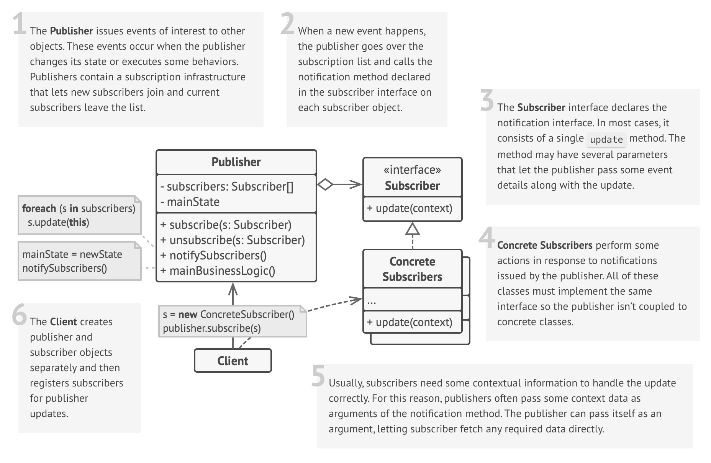

# Observer Design Pattern

## Definition

🎥 Imagine you’re a YouTuber (the Subject).  
You post new videos whenever you have something cool to share — vlogs, gameplays, tutorials, etc. 🎮📸📚

Now you’ve got subscribers:

- A student who watches tutorials 📚
- A gamer who loves your let’s plays 🎮
- A chef who just likes your vibe 🍳

These subscribers are the **Observers** 👀.

**Relating to the pattern:**

- You (the YouTuber) → **Subject**
- Subscribers → **Observers**
- Uploading a new video → **State change**
- Notifications going out → **Automatic updates to observers**

**The Observer Pattern** is a behavioral design pattern that defines a one-to-many dependency between objects. When one object (the subject) changes its state, all dependent objects (observers) are automatically notified and updated.

## Structure



**Main Components**:

- **Publisher** — Maintains a list of subscribers and notifies them of state changes.
- **Subscriber** — Interface for objects that should be notified of changes.
- **Client** — Creates the publisher and subscribers, and establishes the relationship.
- **Notification** — The message or data sent to observers when the subject's state changes.

## Key Characteristics

- **Loose Coupling**  
  The subject and observers only know each other's interfaces, not concrete implementations.  
  _Benefit: Enhances modularity and maintainability._

- **Dynamic Relationships**  
  Observers can be added/removed at runtime without affecting the subject.  
  _Benefit: Increases flexibility and adaptability._

- **Automatic Updates**  
  Observers get notified whenever the subject's state changes, no manual effort needed.  
  _Benefit: Real-time synchronization and minimal risk of outdated data._

- **Broadcast Communication**  
  The subject iterates over all observers and calls a common update method.  
  _Benefit: Efficient and consistent notification to all dependents._

## When to Use?

✅ **Multiple components need to stay in sync with shared data**  
_Example: Weather station pushing updates to apps, displays, and websites._

✅ **Real-time event-driven updates are required**  
_Example: Stock trading platforms pushing live updates._

✅ **Publish/subscribe communication**  
_Example: Chat server broadcasting messages to all group members._

✅ **Separation of data logic and UI**  
_Example: To-do list apps updating UI when tasks are modified._

## When NOT to Use?

❌ **Observer relationships are too complex**  
_Hard to debug when observers depend on multiple subjects._

❌ **Extremely frequent updates where performance is critical**  
_May lead to performance bottlenecks ("update storm")._

❌ **Updates are rare and real-time isn't needed**  
_Polling might be simpler and more efficient._

❌ **Observers can trigger updates back to subjects**  
_Risks infinite loops due to circular dependencies._

❌ **Tight synchronization or specific ordering needed**  
_Observer pattern doesn't guarantee notification order or precise timing._

## Code Example

```python
# Subject
class Subject:
    def __init__(self):
        self._observers = []
    def attach(self, observer):
        self._observers.append(observer)
    def notify(self, message):
        for observer in self._observers:
            observer.update(message)

# Observer
class Observer:
    def update(self, message):
        pass  # To be implemented by concrete observers

# Concrete Observers
class EmailObserver(Observer):
    def update(self, message):
        print(f"📧 Email received: {message}")
class SMSObserver(Observer):
    def update(self, message):
        print(f"📱 SMS received: {message}")

# Usage
if __name__ == "__main__":
    subject = Subject()
    email_observer = EmailObserver()
    sms_observer = SMSObserver()
    subject.attach(email_observer)
    subject.attach(sms_observer)
    # State change triggers notification
    subject.notify("New Promotion: 50% OFF Sale!")
```

## Real World Examples

- **Social Media Feeds** (Twitter/X, Facebook, Instagram) 📱  
  - Subject: User's profile/account
  - Observers: Followers' feeds
  - Flow: New posts automatically update followers' feeds.

- **Weather Monitoring Systems** 🌧❄  
  - Subject: Weather station
  - Observers: Apps, websites, agricultural systems
  - Flow: Updates pushed to all subscribed platforms.

- **Event Management Systems** 🎟  
  - Subject: Event status (e.g., sold-out, new tickets)
  - Observers: Ticket vendors, sponsors, social media
  - Flow: Changes notify all related parties.

- **Online Banking Systems** 💰  
  - Subject: Bank account (balance changes)
  - Observers: Mobile app, SMS service, email alerts
  - Flow: Notifications sent when balance changes.

- **Health Monitoring Systems** 🏥  
  - Subject: Health monitor tracking vital signs
  - Observers: Doctor's dashboard, patient app
  - Flow: Critical changes alert emergency systems.

- **IoT Sensor Networks** 🌐  
  - Subject: SensorHub aggregating sensor data
  - Observers: Dashboards, alert systems
  - Flow: Changes immediately reflected across systems.
