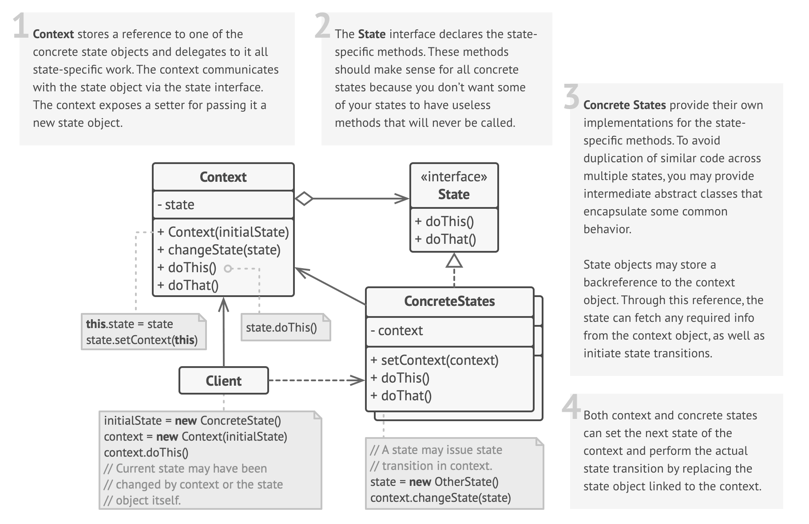

# State Design Pattern

## Definition

Imagine a TV remote:

- **Off (❌)**: Press power ➔ TV turns **on**.
- **On (✅)**: Press power ➔ TV turns **off**.
- **Mute (🔇)**: TV is silent; pressing mute brings back the sound.

The **State Pattern** is a **behavioral design pattern** that **allows an object to change its behavior based on its internal state**.  
Instead of using many `if-else` conditions, behavior is **delegated to state-specific classes**.

## Structure

  

- **Encapsulate state-specific behavior** into separate classes.
- **State objects handle transitions** between states.
- **Allows dynamic behavior changes** at runtime.
- **Follows the Open/Closed Principle**: Easily add new states without modifying existing code.

## Key Characteristics

- **Encapsulates State-Specific Behavior**
  ➔ Organized code with each behavior in its own class.
- **State Objects Handle Transitions**
  ➔ Context object doesn’t manage transitions; states do.
- **Allows Dynamic Behavior Changes**
  ➔ Switching states changes behavior dynamically.
- **Open/Closed Principle Compliance**
  ➔ Add new states easily without changing existing code.

## When to Use

✅ **Complex State-Dependent Behavior**

- Ex: Document editor in *Draft*, *Review*, *Published* states.

✅ **Eliminating Large Conditionals**

- Ex: Vending machine with states like *Idle*, *HasMoney*, *Dispensing*.

✅ **State-Specific Operations**

- Ex: Media player handling *Playing*, *Paused*, *Stopped*.

✅ **Runtime State Changes**

- Ex: Phone switching between *Normal Mode*, *Battery Saver Mode*.

## When NOT to Use

❌ **Simple State Transitions**  
❌ **Resource Constraints** (due to extra classes/objects)  
❌ **Unpredictable State Changes**  
❌ **Centralized State Transition Logic**  
❌ **Short-Lived Objects** (no meaningful state change during lifespan)

---

## Code Example

```python
# State Interface
class OrderState:
    def proceed(self, order):
        raise NotImplementedError("Subclasses must implement this!")

# Concrete States
class ReceivedState(OrderState):
    def proceed(self, order):
        print("Order received. Now processing the order.")
        order.state = ProcessingState()
class ProcessingState(OrderState):
    def proceed(self, order):
        print("Order is being processed. Now dispatching the order.")
        order.state = DispatchedState()
class DispatchedState(OrderState):
    def proceed(self, order):
        print("Order has been dispatched. Delivery in progress.")
        # Final state; no transition here.

# Context
class Order:
    def __init__(self, state: OrderState):
        self.state = state
    def next(self):
        self.state.proceed(self)

# Demonstration:
if __name__ == '__main__':
    order = Order(ReceivedState())
    order.next()  # Transitions from Received to Processing.
    order.next()  # Transitions from Processing to Dispatched.
    order.next()  # No further transition
```

## Real World Examples

| System | Interface | Concrete States | Context |
| :---- | :-------- | :-------------- | :------ |
| **Vending Machine** | VendingMachineState | IdleState, HasMoneyState, DispensingState, OutOfStockState | VendingMachine |
| **Video Game Character** | CharacterState | IdleState, RunningState, AttackingState, DeadState | GameCharacter |
| **Chat App User Presence** | PresenceState | OnlineState, OfflineState, AwayState, BusyState | UserPresence |
| **ATM Machine** | ATMState | NoCardState, HasCardState, AuthorizedState, NoCashState | ATMMachine |
| **Elevator System** | ElevatorState | IdleState, MovingUpState, MovingDownState, DoorOpenState | ElevatorController |
| **Document Workflow System** | DocumentState | DraftState, ReviewState, PublishedState, ArchivedState | Document |
| **E-commerce Product Lifecycle** | ProductState | NewProductState, ActiveState, DiscontinuedState | Product |
| **Printer Job Management** | PrintJobState | QueuedState, PrintingState, CompletedState, ErrorState | PrintJob |
