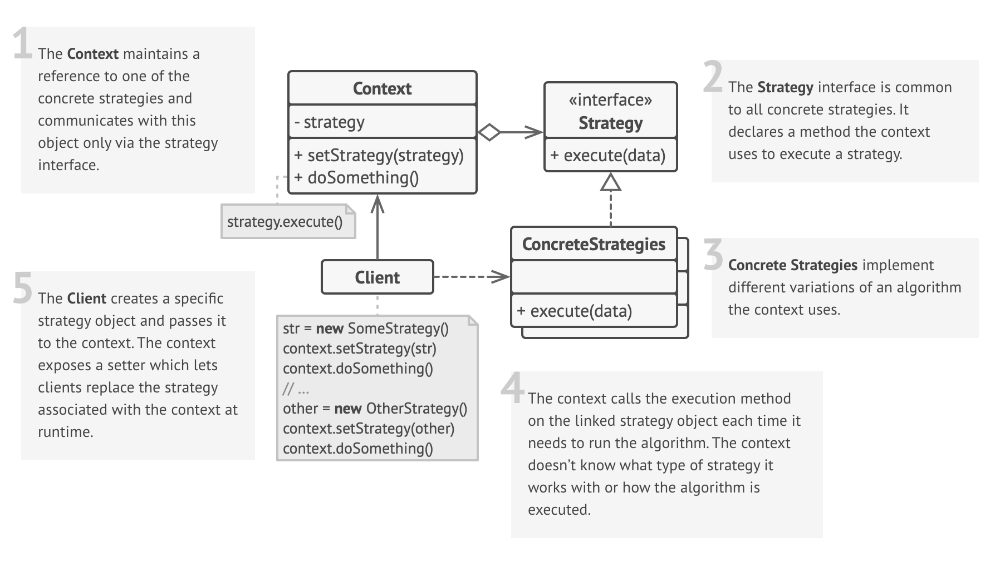

# Strategy Design Pattern

## Definition

Imagine you’re ordering a pizza 🍕 — you have different ways to pay:

- Cash 💵
- Credit Card 💳
- PayPal 🏦

Each method achieves the same result (payment) but works differently.

Similarly, the **Strategy Pattern**:

- Defines a family of algorithms.
- Encapsulates each algorithm.
- Makes them interchangeable.
- Allows algorithms to vary independently from clients that use them.

The Strategy Pattern is a **behavioral design pattern** that enables selecting an algorithm's behavior at runtime. This pattern is useful when you have multiple ways to perform a task, and you want to choose the best one at runtime.

## Structure

  

**Main Components**:

- **Context** — Maintains a reference to a Strategy object.
- **Strategy Interface** — Common interface for all strategies.
- **Concrete Strategies** — Implement different variations of the algorithm.

## Key Characteristics

- **Encapsulation of Behavior**  
  ➔ Each behavior (algorithm) is in its own class.  
  ➔ Easy modification without affecting others.

- **Interchangeability**  
  ➔ Strategies follow the same interface.  
  ➔ Easy swapping at runtime.

- **Decoupling**  
  ➔ Context doesn’t implement the algorithms directly.  
  ➔ Reduces dependencies.

- **Open/Closed Principle**  
  ➔ Open for extension, closed for modification.  
  ➔ Add new strategies without altering existing code.

## When to Use?

✅ **Dynamic Algorithm Switching**  

- Ex: Google Maps switching between Shortest, Fastest, Scenic routes.

✅ **Separation of Business Logic**  

- Ex: WinRAR supporting multiple compression formats (ZIP, RAR, GZIP).

✅ **Reduced Class Duplication**  

- Ex: Amazon Payment Gateway handling multiple payment methods.

✅ **Removing Complex Conditional Statements**  

- Ex: Loan interest calculations based on loan type.

## When NOT to Use?

❌ **Behavior Variations Are Rare**  

- If only 2–3 strategies exist, might be overkill.

❌ **Performance Overhead Concerns**  

- Introduces additional objects and dynamic method calls.

❌ **Client Should Not Manage Strategy**  

- If client shouldn’t handle strategy selection.

❌ **Behavior Tightly Coupled with Context**  

- Encapsulating strategy may break encapsulation.

❌ **Concrete Strategies Share Too Much Code**  

- Might lead to duplication instead of reuse.

## Code Example

```python
from abc import ABC, abstractmethod

# Strategy Interface
class PaymentStrategy(ABC):
    @abstractmethod
    def pay(self, amount):
        pass

# Concrete Strategies
class CreditCardPayment(PaymentStrategy):
    def pay(self, amount):
        print(f"Paid ${amount} using Credit Card.")

class PayPalPayment(PaymentStrategy):
    def pay(self, amount):
        print(f"Paid ${amount} using PayPal.")

# Context
class ShoppingCart:
    def __init__(self, payment_strategy: PaymentStrategy):
        self.payment_strategy = payment_strategy

    def checkout(self, amount):
        self.payment_strategy.pay(amount)

# Usage
cart1 = ShoppingCart(CreditCardPayment())
cart1.checkout(100)

cart2 = ShoppingCart(PayPalPayment())
cart2.checkout(200)
```

## Real-World Examples

- **Payment Methods in E-commerce**  
  - **Interface**: `PaymentStrategy`  
  - **Strategies**: `CreditCardPayment`, `PayPalPayment`  
  - **Context**: `ShoppingCart`

- **Route Calculation in Maps**  
  - **Interface**: `RouteStrategy`  
  - **Strategies**: `CarRoute`, `BikeRoute`, `WalkingRoute`  
  - **Context**: `NavigationSystem`

- **Email Sorting in Gmail**  
  - **Interface**: `EmailSortingStrategy`  
  - **Strategies**: `PrimaryInbox`, `PromotionsInbox`, `SpamFilter`  
  - **Context**: `EmailClient`

- **Image Filters in Instagram/Photoshop**  
  - **Interface**: `ImageFilter`  
  - **Strategies**: `BlackAndWhiteFilter`, `SepiaFilter`, `BlurFilter`  
  - **Context**: `PhotoEditor`

- **Video Playback Quality (YouTube/Netflix)**  
  - **Interface**: `VideoQualityStrategy`  
  - **Strategies**: `AutoQuality`, `HDQuality`, `UltraHDQuality`  
  - **Context**: `VideoPlayer`

- **Difficulty Modes in Games**  
  - **Interface**: `DifficultyStrategy`  
  - **Strategies**: `EasyMode`, `NormalMode`, `HardMode`, `ExpertMode`  
  - **Context**: `GameEngine`

- **Text-to-Speech Engines**  
  - **Interface**: `VoiceStrategy`  
  - **Strategies**: `MaleVoice`, `FemaleVoice`, `AIEnhancedVoice`  
  - **Context**: `TextToSpeechEngine`

- **Auto Text Formatting in Word Processors**  
  - **Interface**: `TextFormatStrategy`  
  - **Strategies**: `BoldFormat`, `ItalicFormat`, `UnderlineFormat`  
  - **Context**: `WordProcessor`
