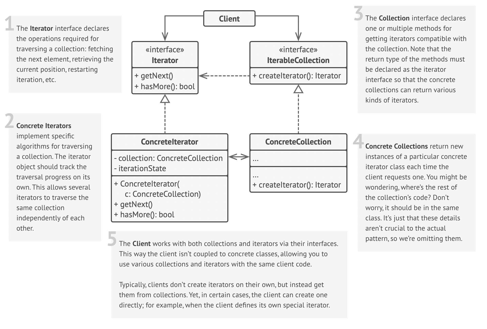

# Iterator Design Pattern

## Definition

🎶 *Imagine you have a music playlist app on your phone. This playlist is a collection of your favorite songs* 🎧.

You don't need to know how the app stores this playlist. Is it a simple list? A linked list for easy reordering? A complex tree sorted by genre? As a user, you don't care. All you need are the controls:

- **Next button** ➡️
- **Previous button** ⬅️
- **A way to know if you're at the end of the playlist**

These controls are your **Iterator**. They give you a simple, standard way to traverse your collection of songs without ever needing to see the complex machinery behind the scenes. You could have a *Shuffle Iterator* that plays songs randomly or a *Repeat-All Iterator* that loops back to the beginning.

**Relating to the pattern:**

- **Your playlist of songs** → *Aggregate (Collection)*
- **The mechanism that keeps track of the current song and knows how to move to the next/previous one** → *Iterator*
- **You pressing the Next button** → *Client using the Iterator to traverse the Collection*

The **Iterator Pattern** is a behavioral design pattern that lets you traverse elements of a collection sequentially without exposing its underlying representation (e.g., list, stack, tree, etc.). It extracts the traversal behavior from the collection and puts it into a separate object called an *iterator*.

## Structure



### Main Components

- **Iterator Interface** — Declares the common interface for traversing collections, including methods like `next()` (get the next element), `has_next()` (check if there's a next element), and `current()` (get the current element).
- **Concrete Iterator** — Implements the Iterator interface for a specific type of collection. It keeps track of its own state, like the current position of the traversal.
- **Aggregate (or Collection) Interface** — Declares one or more factory methods for creating iterator objects (e.g., `create_iterator()`).
- **Concrete Aggregate (or Collection)** — Implements the iterator factory method from the Aggregate interface. It returns a new instance of a Concrete Iterator whenever a client requests one.

## Key Characteristics

**Encapsulation of Traversal Logic** 📦

- The responsibility of traversal is moved from the collection to a separate iterator object.  
**Benefit:** Simplifies the collection's interface and cleans up its code. The collection worries about storing data, and the iterator worries about traversing it.

**Uniform Traversal Interface** 🚶

- Provides a single, standard way for clients to traverse different types of collections (lists, trees, graphs, etc.).  
**Benefit:** The client code becomes more flexible and reusable, as it can work with any collection that provides an iterator.

**Multiple Simultaneous Traversals** 🔄

- You can create multiple independent iterators from the same collection, each maintaining its own state.  
**Benefit:** Allows for things like nested loops or comparing elements within the same collection without interference.

**Support for Different Traversal Algorithms** 🗺️

- The collection can offer different kinds of iterators for different traversal methods (e.g., a `DepthFirstIterator` and a `BreadthFirstIterator` for a tree).  
**Benefit:** Clients can choose the traversal algorithm that best fits their needs without the collection class becoming bloated with multiple traversal methods.

## When to Use?

✅ **To provide a standard way to traverse various data structures.**  
**Example:** Your code needs to process items from a list, a set, and a custom tree object. Using iterators allows your processing logic to be the same for all three.

✅ **To hide the internal complexity of your data structures.**  
**Example:** Your collection is a complex graph, but you want to provide clients with a simple way to get all nodes sequentially without them needing to understand graph traversal algorithms.

✅ **To support multiple, independent traversals over the same collection.**  
**Example:** One part of your code is iterating through a user list to send emails, while another part is iterating through the same list to check for inactive users.

✅ **When you want to support different ways of traversing a collection.**  
**Example:** Providing both forward and backward iterators, or different traversal strategies for a tree (pre-order, in-order, post-order).

## When NOT to Use?

❌ **For very simple collections where a direct loop is sufficient.**  
For basic lists in languages with powerful built-in looping constructs (like Python's `for item in my_list`), creating a formal custom iterator class can be unnecessary overhead.

❌ **When the client needs to know the collection's structure.**  
If the client's logic is fundamentally tied to the collection type (e.g., it specifically needs list indexing `my_list[i]`), an iterator might not be the right abstraction.

❌ **In extremely performance-critical scenarios where the minor overhead of an iterator object is unacceptable.**  
This is very rare, but in some low-level or high-frequency computing, avoiding any object allocation or indirection might be a priority.

## Code Example

```python
from collections.abc import Iterable, Iterator

# Concrete Aggregate (Collection)
class SongPlaylist(Iterable):
    def __init__(self, songs: list[str]):
            self._songs = songs

    def __iter__(self) -> Iterator:
            # This is the factory method that returns a new iterator instance.
            return PlaylistIterator(self._songs)

# Concrete Iterator
class PlaylistIterator(Iterator):
    def __init__(self, songs: list[str]):
            self._songs = songs
            self._index = 0

    def __next__(self):
            # Returns the next element or raises StopIteration
            try:
                    song = self._songs[self._index]
                    self._index += 1
            except IndexError:
                    raise StopIteration()
            return song

# --- Client Code ---
if __name__ == "__main__":
    playlist = SongPlaylist(["Bohemian Rhapsody", "Stairway to Heaven", "Hotel California"])

    print("Iterating through the playlist:")
    # The 'for' loop automatically calls __iter__ to get an iterator,
    # and then calls __next__ on it repeatedly.
    for song in playlist:
            print(f"Now playing: 🎶 {song}")

    # You can have multiple iterators at the same time:
    print("\n--- Multiple independent iterators ---")
    iterator1 = iter(playlist)
    iterator2 = iter(playlist)

    print(f"Iterator 1, Next: {next(iterator1)}") # Bohemian Rhapsody
    print(f"Iterator 1, Next: {next(iterator1)}") # Stairway to Heaven
    print(f"Iterator 2, Next: {next(iterator2)}") # Bohemian Rhapsody (starts from beginning)
```

## Real World Examples

### Programming Language Loops (for-each) 💻

- **Client:** The code block inside the for loop that processes each item.
- **Aggregate (Collection):** The collection object itself (e.g., a Python list, Java ArrayList, C# List<T>).
- **Iterator:** An internal, hidden iterator object created by the language's runtime. It adheres to the language's specific iterator protocol (like Python's `__iter__` and `__next__`).
- **Flow:** The for loop construct asks the collection to create an iterator. In each cycle, it calls the iterator's `next()` method and assigns the result to the loop variable until the iterator signals it's finished (e.g., by raising a `StopIteration` exception in Python).

### Database Cursors 💾

- **Client:** The application code (e.g., a Python script using a database driver) that needs to process query results.
- **Aggregate (Collection):** The entire result set of a database query, which can be millions of rows and resides on the database server.
- **Iterator:** The Cursor object provided by the database driver.
- **Flow:** The client executes a query and receives a Cursor. It then repeatedly calls a method like `cursor.fetchone()` or loops over the cursor (`for row in cursor:`), which acts as the `next()` operation to retrieve rows from the database without loading the entire result set into the application's memory.

### Streaming Data (Files, Network Sockets) 🌊

- **Client:** The logic that processes the data, for instance, a function parsing log entries.
- **Aggregate (Collection):** The entire file on disk or the complete data stream from a network socket.
- **Iterator:** The file handle or socket object returned by the operating system/runtime.
- **Flow:** The client opens a file, returning a file handle (the iterator). The client can then loop over this handle (e.g., `for line in file_handle:`), which implicitly calls the iterator's `next()` method to read one line or chunk of data at a time, making it highly memory-efficient.

### Social Media Feeds 📱

- **Client:** The social media app's UI rendering engine that displays posts.
- **Aggregate (Collection):** The vast collection of all posts available for a user's feed, stored on the company's backend servers.
- **Iterator:** A stateful API mechanism, often using pagination cursors or tokens, that tracks the last post viewed.
- **Flow:** The client app makes an initial API call to get the first "page" of posts. When the user scrolls, the app uses a token from the previous response to make a new API request for the "next" page of posts. The server-side API logic acts as the iterator.

### Pagination in Web UIs and APIs 📄

- **Client:** A user's web browser rendering a webpage or an API client application.
- **Aggregate (Collection):** The total set of items (e.g., all products in a category, all articles on a blog) stored in the backend.
- **Iterator:** The backend pagination logic, which keeps track of the current page and total items. It's exposed via URL parameters (e.g., `?page=3`) or API cursor tokens.
- **Flow:** When a user clicks the "Next Page" link, the browser makes a request for the next page index. This request is handled by the server-side iterator logic, which retrieves and returns the correct slice of data.

### Music and Video Playlists ⏯️

- **Client:** The user interacting with the media player UI (e.g., clicking the "next" button).
- **Aggregate (Collection):** The Playlist object, which holds a collection of Song or Video objects.
- **Iterator:** A PlaylistIterator object that maintains the current track's index. There could be other concrete iterators like ShuffleIterator or RepeatIterator for the same playlist.
- **Flow:** The user's action on the UI triggers a call to `iterator.next()`, which returns the next media object for the player engine to play.

### Tree and Graph Traversal Algorithms 🌳

- **Client:** A function or algorithm that needs to process all nodes in a graph or tree, such as a search or serialization algorithm.
- **Aggregate (Collection):** The Graph or Tree data structure itself.
- **Iterator:** A specialized iterator object like DepthFirstIterator or BreadthFirstIterator.
- **Flow:** The client asks the graph to create a specific type of iterator (e.g., `graph.create_bfs_iterator()`). It then uses a simple loop to consume nodes one at a time in the desired traversal order, completely hiding the complex recursive or queue-based traversal logic.

### Turn-by-Turn GPS Navigation 🗺️🚗

- **Client:** The driver who is following the directions.
- **Aggregate (Collection):** The Route object, which is an ordered collection of Direction steps (e.g., "Turn left on Main St.", "Continue for 2 miles").
- **Iterator:** The core navigation system logic that tracks the driver's current position and the current step in the route.
- **Flow:** The system presents the `current()` instruction. When location sensors detect the driver has completed that step, the system internally calls `next()` to advance to the subsequent direction and presents it to the driver.
