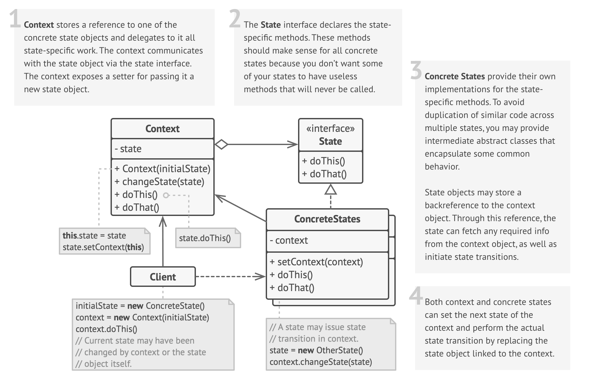

# State Design Pattern

## Definition

Imagine a TV remote:

- **Off (❌)**: Press power ➔ TV turns **on**.
- **On (✅)**: Press power ➔ TV turns **off**.
- **Mute (🔇)**: TV is silent; pressing mute brings back the sound.

The **State Pattern** is a **behavioral design pattern** that **allows an object to change its behavior based on its internal state**.  
Instead of using many `if-else` conditions, behavior is **delegated to state-specific classes**.

## Structure

  

### Main Components

- **State Interface**: Defines the interface for state-specific behavior.
- **Concrete States**: Implement the state interface, encapsulating state-specific behavior.
- **Context**: Maintains a reference to the current state and delegates behavior to it. It can change its state dynamically.
- **Client**: Interacts with the context, triggering state transitions.

## Key Characteristics

**Encapsulates State-Specific Behavior**

- Organized code with each behavior in its own class.  
**Benefit**: Reduces complexity and improves maintainability.

**State Objects Handle Transitions**

- Context object doesn’t manage transitions; states do.  
**Benefit**: Simplifies the context and centralizes state logic.

**Allows Dynamic Behavior Changes**

- Switching states changes behavior dynamically.  
**Benefit**: Enables flexible and adaptive systems.

**Open/Closed Principle Compliance**

- Add new states easily without changing existing code.  
**Benefit**: Enhances extensibility and reduces risk of bugs.

## When to Use

✅ **Complex State-Dependent Behavior**  
**Example**: Document editor in *Draft*, *Review*, *Published* states.

✅ **Eliminating Large Conditionals**  
**Example**: Vending machine with states like *Idle*, *HasMoney*, *Dispensing*.

✅ **State-Specific Operations**  
**Example**: Media player handling *Playing*, *Paused*, *Stopped*.

✅ **Runtime State Changes**  
**Example**: Phone switching between *Normal Mode*, *Battery Saver Mode*.

## When NOT to Use

❌ **Simple State Transitions**  
If the state transitions are straightforward and can be handled with simple conditionals.

❌ **Resource Constraints** (due to extra classes/objects)  
If the system has limited resources or performance is critical.

❌ **Unpredictable State Changes**  
If the state changes are too unpredictable or frequent, making it hard to manage states effectively.

❌ **Centralized State Transition Logic**  
If the logic for state transitions is already centralized and simple, using the State Pattern may add unnecessary complexity.

❌ **Short-Lived Objects** (no meaningful state change during lifespan)
If the object has a short lifespan and does not undergo significant state changes, the overhead of managing states may not be justified.

## Code Example

```python
# State Interface
class OrderState:
    def proceed(self, order):
        raise NotImplementedError("Subclasses must implement this!")

# Concrete States
class ReceivedState(OrderState):
    def proceed(self, order):
        print("Order received. Now processing the order.")
        order.state = ProcessingState()
class ProcessingState(OrderState):
    def proceed(self, order):
        print("Order is being processed. Now dispatching the order.")
        order.state = DispatchedState()
class DispatchedState(OrderState):
    def proceed(self, order):
        print("Order has been dispatched. Delivery in progress.")
        # Final state; no transition here.

# Context
class Order:
    def __init__(self, state: OrderState):
        self.state = state
    def next(self):
        self.state.proceed(self)

# Demonstration:
if __name__ == '__main__':
    order = Order(ReceivedState())
    order.next()  # Transitions from Received to Processing.
    order.next()  # Transitions from Processing to Dispatched.
    order.next()  # No further transition
```

## Real World Examples

- **Vending Machine 🥤**  
  - **System**: Vending Machine  
  - **Interface**: VendingMachineState  
  - **Concrete States**: IdleState, HasMoneyState, DispensingState, OutOfStockState  
  - **Context**: VendingMachine  

- **Video Game Character 🎮**  
  - **System**: Video Game Character  
  - **Interface**: CharacterState  
  - **Concrete States**: IdleState, RunningState, AttackingState, DeadState  
  - **Context**: GameCharacter  

- **Chat App User Presence 💬**  
  - **System**: Chat App User Presence  
  - **Interface**: PresenceState  
  - **Concrete States**: OnlineState, OfflineState, AwayState, BusyState  
  - **Context**: UserPresence  

- **ATM Machine 🏧**  
  - **System**: ATM Machine  
  - **Interface**: ATMState  
  - **Concrete States**: NoCardState, HasCardState, AuthorizedState, NoCashState  
  - **Context**: ATMMachine  

- **Elevator System 🛗**  
  - **System**: Elevator System  
  - **Interface**: ElevatorState  
  - **Concrete States**: IdleState, MovingUpState, MovingDownState, DoorOpenState  
  - **Context**: ElevatorController  

- **Document Workflow System 📄**  
  - **System**: Document Workflow System  
  - **Interface**: DocumentState  
  - **Concrete States**: DraftState, ReviewState, PublishedState, ArchivedState  
  - **Context**: Document  

- **E-commerce Product Lifecycle 🛒**  
  - **System**: E-commerce Product Lifecycle  
  - **Interface**: ProductState  
  - **Concrete States**: NewProductState, ActiveState, DiscontinuedState  
  - **Context**: Product  

- **Printer Job Management 🖨️**  
  - **System**: Printer Job Management  
  - **Interface**: PrintJobState  
  - **Concrete States**: QueuedState, PrintingState, CompletedState, ErrorState  
  - **Context**: PrintJob  
