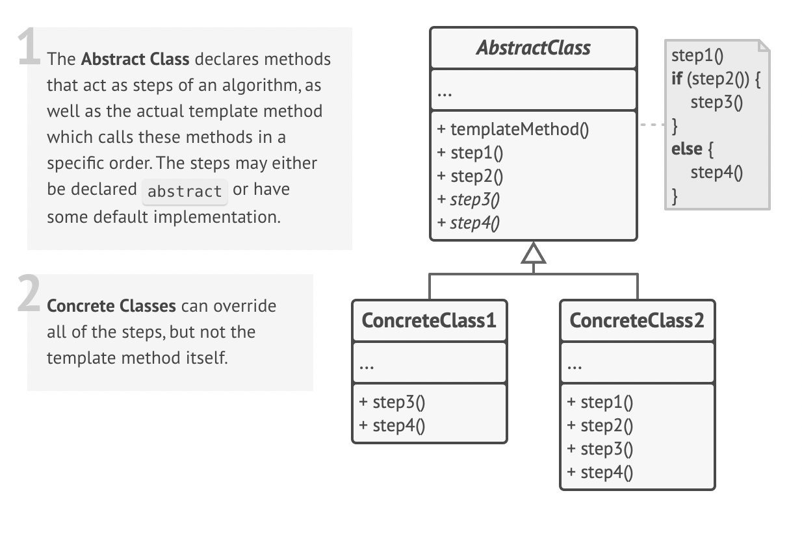

# Template Method Design Pattern

## Definition

Imagine you're designing the manufacturing process for a car company. Every car, whether it's a family sedan or a rugged SUV, goes through the same high-level assembly steps on the factory line:

1. **Build the chassis** (the frame)
2. **Install the engine and powertrain**
3. **Mount the body panels**
4. **Paint the car**
5. **Add the interior** (seats, dashboard, etc.)

This sequence of steps is a fixed template—you can't install the interior before the body panels are on! However, the details of each step can change dramatically:

- An SUV will get a **V8 engine**, while a sedan gets a **V4**.
- The SUV might be painted **"Forrest Green"**, while the sedan is **"Midnight Blue"**.
- The SUV gets **rugged cloth seats**, while the sedan gets **luxury leather seats**.

**Relating to the pattern:**

- The overall assembly line process → **Template Method** in a base class.
- Fixed steps like "Build Chassis" → **Concrete methods** in the base class.
- Variable steps like "Install Engine" or "Paint the Car" → **Abstract methods or Hooks** that specific subclasses must implement.
- A `SedanFactory` or `SUVFactory` → **Concrete Subclasses** that provide the specific implementations for the variable steps.

The Template Method Pattern is a **behavioral design pattern** that defines the skeleton of an algorithm in a base class but lets subclasses override specific steps of the algorithm without changing its structure.

## Structure



### Main Components

- **AbstractClass** — Defines the main `templateMethod()`. This method serves as a skeleton for the algorithm and calls a sequence of other methods. It also defines:
  - **Abstract Operations:** Methods that are declared abstract and must be implemented by subclasses.
  - **Concrete Operations:** Methods that are already implemented in the base class (common for all subclasses).
  - **Hooks:** Methods with a default (usually empty) implementation. Subclasses are free to override them, but it's not mandatory. Hooks provide optional extension points in the algorithm.
- **ConcreteClass** — Subclasses the `AbstractClass` and provides concrete implementations for the required abstract operations. It can also choose to override the optional hooks to customize the algorithm's behavior further.

## Key Characteristics

**Defines an Algorithm Skeleton** 🏗️

- The overall structure and sequence of an algorithm are fixed in one place (the base class).  
**Benefit:** Ensures a consistent workflow while allowing for customization.

**Inversion of Control (The "Hollywood Principle")** 🎬

- This pattern embodies the principle: "Don't call us, we'll call you." The high-level base class calls methods on the subclass to perform specific steps, not the other way around.  
**Benefit:** The framework (base class) controls the flow, and the custom code (subclass) just fills in the details.

**Code Reusability** 🔁

- Common steps of the algorithm are implemented once in the base class and reused by all subclasses.  
**Benefit:** Reduces code duplication and makes the system easier to maintain.

**Customization via Subclassing** 🛠️

- Provides well-defined extension points (abstract methods and hooks) for subclasses to inject their specific logic.  
**Benefit:** Offers a controlled way to extend functionality without altering the core algorithm structure.

## When to Use?

✅ **When you want to let clients extend an algorithm using only specific steps.**  
**Example**: Building a framework where users provide their own content for specific parts, but you control the overall flow and rendering.

✅ **When you have several classes with algorithms that contain similar steps.**  
**Example**: Processing different file types (CSV, JSON, XML) that share many steps (open file, close file, report errors).

✅ **To avoid code duplication by centralizing the common parts of an algorithm.**  
**Example**: If you find yourself copy-pasting a block of code and changing only one or two lines, Template Method is a strong candidate.

## When NOT to Use?

❌ **When the algorithm's structure itself needs to vary significantly.**  
If subclasses need to change the order of steps or omit steps entirely, the fixed skeleton becomes a liability. The Strategy Pattern is often a better choice.

❌ **For very simple algorithms.**  
If the algorithm only has one or two steps, creating a whole class hierarchy is likely over-engineering.

❌ **If there are too many variations, leading to a complex base class.**  
If the base class needs a large number of abstract methods or hooks to support all possible variations, it can become a maintenance bottleneck.

## Code Example

```python
from abc import ABC, abstractmethod

# AbstractClass
class DataProcessor(ABC):
    # This is the Template Method
    def process(self, path: str):
        self.load_data(path)
        self.parse_data()
        if self.should_analyze():  # A hook
            self.analyze_data()
        self.save_report()
        print("--- Processing Complete ---")

    # Concrete method common to all subclasses
    def load_data(self, path: str):
        print(f"Loading data from {path}...")
        self._data = f"Data from {path}" # Simulate loading

    @abstractmethod
    def parse_data(self):
        # Must be implemented by subclasses
        pass

    @abstractmethod
    def analyze_data(self):
        # Must be implemented by subclasses
        pass

    # Concrete method common to all subclasses
    def save_report(self):
        print("Saving report...")

    # A "Hook" method - subclasses can override it, but don't have to.
    def should_analyze(self) -> bool:
        return True

# ConcreteClass 1
class CsvDataProcessor(DataProcessor):
    def parse_data(self):
        print("Parsing CSV data...")

    def analyze_data(self):
        print("Analyzing CSV specific trends...")

# ConcreteClass 2
class JsonDataProcessor(DataProcessor):
    def parse_data(self):
        print("Parsing JSON data...")

    def analyze_data(self):
        print("Analyzing JSON data structure...")

    # Overriding the hook
    def should_analyze(self) -> bool:
        print("JSON processor hook: Analysis will be skipped.")
        return False

# --- Client Code ---
if __name__ == "__main__":
    print("--- Processing a CSV file ---")
    csv_processor = CsvDataProcessor()
    csv_processor.process("data.csv")

    print("\n--- Processing a JSON file ---")
    json_processor = JsonDataProcessor()
    json_processor.process("data.json")
```

## Real World Examples

### Web Framework Request Handling (e.g., Django) 🌐

- **AbstractClass:** A base `View` or `APIView` class provided by the framework.
- **Template Method:** An internal `dispatch()` method that orchestrates the handling of an HTTP request.
- **Steps/Hooks:** `dispatch()` calls methods like `perform_authentication()`, `check_permissions()`, and then calls a method specific to the HTTP verb like `get()` or `post()`.
- **ConcreteClass:** Your own view class, like `UserProfileView(APIView)`.
- **Flow:** You subclass `APIView` and only implement the `get()` or `post()` method. The framework's template method handles the repetitive boilerplate of auth and permissions for you.

### Unit Testing Frameworks (e.g., Python's unittest) 🧪

- **AbstractClass:** The `unittest.TestCase` class.
- **Template Method:** An internal `run()` method invoked by the test runner.
- **Steps/Hooks:** The `run()` method's algorithm is: call `setUp()`, call the actual test method (e.g., `test_addition`), call `tearDown()`.
- **ConcreteClass:** Your test class, like `TestMyMathFunctions(unittest.TestCase)`.
- **Flow:** You subclass `TestCase`, write your `test_*` methods, and optionally override the `setUp()` and `tearDown()` hooks to prepare and clean up the test environment. The framework runs them in the correct sequence.

### Data Export / ETL Processes 📊

- **AbstractClass:** A generic `DataExporter` class.
- **Template Method:** An `export_data()` method.
- **Steps/Hooks:** Its steps are `connect_source()`, `extract_data()`, `transform_data()`, `load_to_destination()`, `close_connection()`.
- **ConcreteClass:** `MySqlToCsvExporter` or `MongoToS3Exporter`.
- **Flow:** Each concrete class implements the extract, transform, and load steps specific to its sources and destinations, while the base class handles the general connection and closing logic.

### Game AI Logic 🤖

- **AbstractClass:** A `BaseAICharacter` class.
- **Template Method:** A `take_turn()` method that gets called every game loop.
- **Steps/Hooks:** `assess_threats()`, `select_best_target()`, `execute_primary_action()`, `reposition()`.
- **ConcreteClass:** `AggressiveEnemyAI`, `DefensiveSupportAI`.
- **Flow:** `AggressiveEnemyAI` implements `select_best_target` to pick the weakest player, while `DefensiveSupportAI` implements it to pick the most injured ally to heal. The overall turn structure remains the same.

### Document Generation (PDF, HTML Reports) 📄

- **AbstractClass:** A `ReportGenerator` class.
- **Template Method:** `generate()`.
- **Steps/Hooks:** `add_header()`, `add_body()`, `add_footer()`, `format_page_numbers()`.
- **ConcreteClass:** `PdfFinancialReport`, `HtmlUserActivityReport`.
- **Flow:** Both subclasses follow the same structure, but `PdfFinancialReport` uses a PDF library to implement the steps, while `HtmlUserActivityReport` uses HTML tags.

### User Authentication Workflows 🔐

- **AbstractClass:** A generic `Authenticator`.
- **Template Method:** `authenticate()`.
- **Steps/Hooks:** `get_credentials_from_request()`, `validate_credentials()`, `on_success_hook()`, `on_failure_hook()`.
- **ConcreteClass:** `PasswordAuthenticator`, `OAuth2Authenticator`.
- **Flow:** `PasswordAuthenticator` implements `validate_credentials` by checking a password hash in the DB. `OAuth2Authenticator` implements it by validating a token with an external provider. The `on_success_hook` can create a session token regardless of the method used.

### Android App Activity Lifecycle 📱

- **AbstractClass:** Android's base `Activity` class.
- **Template Method:** The Android OS itself acts as the invoker of a template lifecycle.
- **Steps/Hooks:** The lifecycle consists of a fixed sequence of calls: `onCreate()`, `onStart()`, `onResume()`, `onPause()`, `onStop()`, `onDestroy()`.
- **ConcreteClass:** Your app's specific `MainActivity`.
- **Flow:** You subclass `Activity` and override the lifecycle hooks (`onCreate`, `onResume`, etc.) to add your app's specific behavior at each stage. The OS guarantees they will be called in the correct order.

### Swing/JavaFX UI Components 🖼️

- **AbstractClass:** A base component class like `javax.swing.JComponent`.
- **Template Method:** The `paint()` method.
- **Steps/Hooks:** The public `paint()` method performs setup/teardown (like setting up graphics context, handling clipping) and then calls protected hooks like `paintComponent()`, `paintBorder()`, and `paintChildren()`.
- **ConcreteClass:** Your custom component, like `MyCustomButton`.
- **Flow:** To create a custom look, you subclass `JComponent` and only override `paintComponent()`. You don't need to worry about the other steps, as the template method handles them for you.
