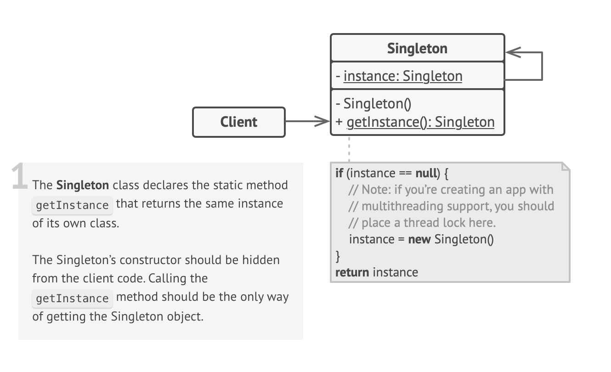

# Singleton Design Pattern

## Definition

🏛️ Imagine the government of a country. A country can have only one official head of state at any given time, for example, a President or a Prime Minister 👑.

No matter who needs to deal with the head of state—a citizen, a foreign diplomat, or a government department—they all interact with the same single person. It's impossible for two different people to be the official President at the same time. There is a single, globally recognized point of access for that role.

Relating to the pattern:

- **The role of "The President"** → Singleton Class
- **The actual, single person holding the office** → Singleton Instance
- **The official process to contact the President's office** → Global Access Method (`getInstance()`)
- **Citizens, diplomats, and departments who need to interact with the President** → Clients

The **Singleton Pattern** is a creational design pattern that ensures a class has only one instance and provides a global point of access to that instance.

> **A Word of Caution ⚠️**
>
> The Singleton pattern is often criticized and can be considered an "anti-pattern" if misused. It can introduce global state into an application, making components tightly coupled and difficult to test. Modern approaches like Dependency Injection are often preferred for managing shared resources. However, understanding Singleton is crucial as it's still used in many systems and is a classic pattern.

## Structure



### Main Components

- **Singleton Class** — This class is responsible for its own unique instance. It contains:
  - A private constructor to prevent other objects from creating new instances using the `new` operator.
  - A private static field that holds the single instance.
  - A public static creation method (commonly named `getInstance()` or `get_instance()`) that acts as the global access point. This method ensures that only one instance is ever created.

## Key Characteristics

**Single Instance Guarantee** ☝️

- The core feature of the pattern. The class ensures no more than one instance of itself is ever created.  
**Benefit:** Essential for managing resources that are inherently singular, like a connection pool or a hardware interface.

**Global Point of Access** 🌍

- Provides a single, well-known method for any part of the application to get a reference to that one instance.  
**Benefit:** Convenience and consistency in accessing the shared resource.

**Controlled Instantiation** 🔒

- The class itself controls the instantiation process, often through a private constructor and a static method.  
**Benefit:** Prevents accidental or unauthorized creation of multiple instances.

**Lazy Initialization (Optional)** ⏳

- The single instance can be created the first time the `getInstance()` method is called, rather than at application startup.  
**Benefit:** Saves resources if the instance is resource-intensive and might not be used during every run of the application.

## When to Use?

✅ **When a class for a shared resource must have exactly one instance across the system**  
**Example:** A single logging service, a shared database connection pool, or a configuration manager.

✅ **When you need a global variable, but with more control**  
**Example:** A Singleton is essentially a more structured and safer global variable because the class can manage its own creation and ensure it's not accidentally replaced.

✅ **For managing a resource that is expensive to create**  
**Example:** By ensuring only one instance is created (especially with lazy initialization), you can save system resources.

✅ **To represent a physical device that is singular in a system**  
**Example:** A printer spooler or a hardware interface manager.

## When NOT to Use?

❌ **It violates the Single Responsibility Principle (SRP)**  
The class is responsible for its own business logic and for managing its lifecycle/instance uniqueness. These are two separate responsibilities.

❌ **It can act as a "global variable," hiding dependencies**  
When a class calls `MySingleton.getInstance()`, it creates a hidden dependency. This makes the code harder to understand and test, as you can't easily see what components a class relies on from its constructor or method signatures.

❌ **It makes unit testing very difficult**  
Because it carries a global state and can't be easily subclassed or mocked, replacing a Singleton with a test double (a mock object) is often difficult or impossible. This makes it hard to test components that rely on the Singleton in isolation.

❌ **It can cause issues in multithreaded environments**  
The `getInstance()` method must be carefully implemented with locks or other synchronization mechanisms to prevent race conditions where multiple threads could create multiple instances simultaneously. This adds complexity.

## Code Example

Here is a concise, thread-safe Python implementation of a Logger Singleton:

```python
import threading

class Logger:
    _instance = None
    _lock = threading.Lock() # Lock for thread safety

    # Override __new__ to control object creation
    def __new__(cls):
        # Double-checked locking pattern for thread safety
        if cls._instance is None:
            with cls._lock:
                # Another check inside the lock
                if cls._instance is None:
                    cls._instance = super().__new__(cls)
                    cls._instance._log_file = "app.log"
                    with open(cls._instance._log_file, "w") as f:
                        f.write("--- Log Started ---\n")
        return cls._instance

    def log(self, message: str):
        with self._lock:
            with open(self._log_file, "a") as f:
                f.write(f"{message}\n")

# --- Client Code ---
def task_one():
    logger1 = Logger()
    logger1.log("Task One: Logging a message.")
    print(f"Task One Logger ID: {id(logger1)}")

def task_two():
    logger2 = Logger()
    logger2.log("Task Two: Logging another message.")
    print(f"Task Two Logger ID: {id(logger2)}")

if __name__ == "__main__":
    # Both functions will receive the exact same Logger instance.
    t1 = threading.Thread(target=task_one)
    t2 = threading.Thread(target=task_two)
    
    t1.start()
    t2.start()
    
    t1.join()
    t2.join()
    
    print("\nCheck app.log to see the output from both tasks.")
    # The output will show that both logger IDs are identical.
```

## Real World Examples

- **Logging Service** 📜  
  - **Singleton Class:** Logger.  
  - **Single Instance:** The one Logger object that manages writing to a specific log file.  
  - **Global Access Point:** `Logger()` (using Python's `__new__`) or `Logger.get_instance()`.  
  - **Client(s):** Various services, modules, and functions throughout the application.  
  - **Flow:** Any part of the application that needs to log an event gets the single logger instance and calls its `log()` method. This prevents multiple parts of the app from trying to write to the same file simultaneously in an uncoordinated way.

- **Configuration Manager** ⚙️  
  - **Singleton Class:** ConfigManager.  
  - **Single Instance:** The one object that holds all application configuration settings (e.g., database URL, API keys).  
  - **Global Access Point:** `ConfigManager.get_instance()`.  
  - **Client(s):** Any part of the application that needs a configuration value.  
  - **Flow:** On startup or first use, the ConfigManager instance is created, loading settings from a file (e.g., `.env`, `config.json`). All other components then request this single instance to get configuration values, ensuring everyone uses the same settings and the file is only read once.

- **Database Connection Pool** 🏊  
  - **Singleton Class:** DatabaseConnectionPool.  
  - **Single Instance:** The one pool object that manages a set of active database connections.  
  - **Global Access Point:** `DatabaseConnectionPool.get_instance()`.  
  - **Client(s):** Data Access Objects (DAOs) or services that need to execute database queries.  
  - **Flow:** Clients request a connection from the singleton pool. The pool manages lending out and receiving back connections, preventing the expensive process of creating new database connections for every query. There is only one pool for the entire application.

- **Hardware Interface Access (e.g., Printer Spooler)** 🖨️  
  - **Singleton Class:** PrinterSpooler.  
  - **Single Instance:** The one object that manages the queue of print jobs for a physical printer.  
  - **Global Access Point:** `PrinterSpooler.getInstance()`.  
  - **Client(s):** Different applications or users wanting to print documents.  
  - **Flow:** When a client wants to print, it adds the job to the single PrinterSpooler instance. The spooler manages the queue in a coordinated way, preventing conflicts and ensuring jobs are printed one by one.

- **In-memory Cache** 🗄️  
  - **Singleton Class:** ApplicationCache.  
  - **Single Instance:** The one cache object that stores frequently accessed data in memory.  
  - **Global Access Point:** `ApplicationCache.get_instance()`.  
  - **Client(s):** Services that need to read or write data.  
  - **Flow:** Before making an expensive database call or API request, a client checks the singleton ApplicationCache. If the data is present, it's returned quickly. If not, the client fetches the data from the source, puts it in the cache via the singleton instance, and then uses it.

- **Application "Session" Object** 👤  
  - **Singleton Class:** UserSession.  
  - **Single Instance:** The object representing the currently logged-in user and their session data.  
  - **Global Access Point:** `UserSession.get_current()`.  
  - **Client(s):** UI components, services, and security layers.  
  - **Flow:** After a user logs in, a UserSession singleton instance is created and populated with their details (user ID, roles, etc.). Any part of the application can then access this single instance to check permissions or get user information without passing the session object around everywhere.

- **Game "Manager" Classes** 🎮  
  - **Singleton Class:** AudioManager, GameManager, ScoreManager.  
  - **Single Instance:** The one object responsible for managing all game audio, the main game state, or the score.  
  - **Global Access Point:** `AudioManager.instance()`.  
  - **Client(s):** Game objects like players, enemies, and UI elements.  
  - **Flow:** When an explosion happens, the Explosion object gets the singleton AudioManager instance and calls `audioManager.play("explosion.wav")`. When a player scores, it calls `scoreManager.add_points(100)`. This provides a central point of control for global game systems.

- **Undo/Redo Manager in an Application** ⏪  
  - **Singleton Class:** UndoRedoManager.  
  - **Single Instance:** The one object that maintains the global stack of commands that can be undone or redone.  
  - **Global Access Point:** `UndoRedoManager.get_instance()`.  
  - **Client(s):** Any user action that is reversible (typing, deleting, drawing).  
  - **Flow:** When a user performs an action, the corresponding Command object is pushed onto the singleton UndoRedoManager's undo stack. When the user hits Ctrl+Z, the UI calls `undoRedoManager.undo()`, which pops the last command and executes its undo method.
