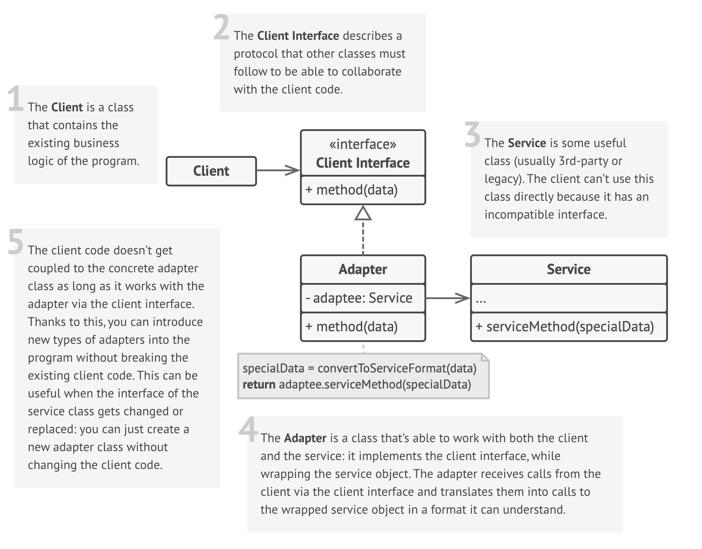
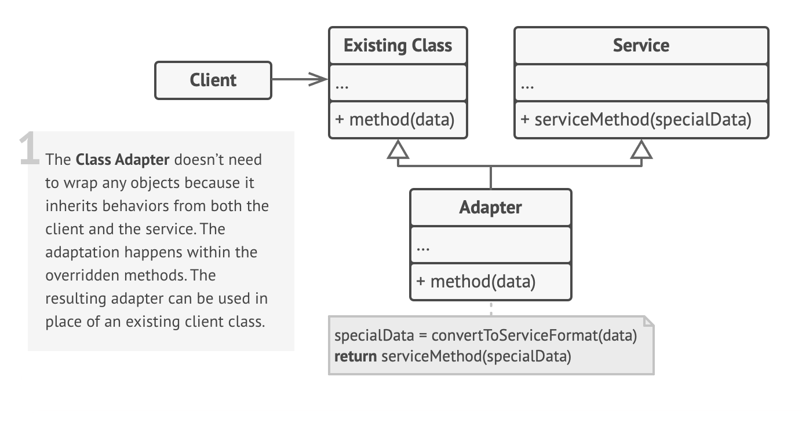

# Adapter Design Pattern

## Definition

Imagine you're traveling from the USA to Europe. You arrive at your hotel, ready to charge your laptop, but you discover a problem: your laptop's plug (with flat prongs) doesn't fit into the European wall socket (with round holes). They are incompatible.

You don't throw away your perfectly good laptop charger. Instead, you use a simple, life-saving device: a travel power adapter. You plug your US charger into the adapter, and the adapter's prongs fit perfectly into the European socket.

**Relating to the pattern:**

- **Your laptop charger** → Adaptee (the existing, useful object with an incompatible interface)
- **The European wall socket** → Target Interface (the interface the client system expects)
- **You** → Client (the one who needs to get the job done)
- **The travel power adapter** → Adapter (the object that makes the two compatible)

The Adapter Pattern is a **structural design pattern** that allows objects with incompatible interfaces to collaborate. It acts as a wrapper between two objects, catching calls for one object and transforming them into a format and interface recognizable by the other.

## Structure and Components

The Adapter Pattern has two main implementations, each with a distinct structure:

### 1. Object Adapter Pattern

This implementation uses **composition** to adapt one interface to another. It's more common and flexible.



Components:

- **Client** — The class that wants to use the Adaptee's functionality but requires objects conforming to the Target Interface.
- **Target Interface** — The interface that the Client expects to work with.
- **Adaptee/Service** — The existing class with useful functionality but an incompatible interface.
- **Adapter** — The class that implements the Target Interface and contains a reference to an Adaptee instance. It translates calls to the Target Interface into appropriate calls to the Adaptee.

### 2. Class Adapter Pattern

This implementation uses **inheritance** (multiple inheritance in languages that support it) to adapt interfaces.



Components:

- **Client** — The class that wants to use the Adaptee's functionality but requires objects conforming to the Target Interface.
- **Target Interface** — The interface that the Client expects to work with.
- **Adaptee** — The existing class with useful functionality but an incompatible interface.
- **Adapter** — The class that inherits from both the Target Interface and the Adaptee. It implements the Target Interface methods by using the inherited methods from the Adaptee.

## Key Characteristics

**Interface Conversion** 🔄

- Converts one interface into another that a client expects.  
**Benefit:** Enables collaboration between classes that couldn't otherwise work together due to incompatible interfaces.

**Wrapper** 🎁

- The Adapter class acts as a wrapper around the Adaptee object.  
**Benefit:** The original Adaptee class doesn't need to be modified, which is crucial when working with external or legacy code.

**Decoupling** 🔗

- Decouples the Client from the concrete implementation of the Adaptee. The Client only knows about the Target interface.  
**Benefit:** You can swap out the Adaptee or even the Adapter itself with a different implementation without changing the Client code.

**Promotes Reusability** ♻️

- Allows you to reuse existing classes and components, even if they weren't designed for your system's specific interface.  
**Benefit:** Saves time and effort by integrating already-tested and reliable functionality.

## When to Use?

✅ **When you want to create a reusable class that needs to cooperate with various unrelated classes.**  
**Benefit:** The Adapter pattern allows you to create a single interface that can work with multiple classes, making your code more modular and easier to maintain.

✅ **When you are working with legacy code that you cannot modify.**  
**Benefit:** The Adapter pattern allows you to integrate legacy systems without changing their code, which is often necessary in large, complex systems.

✅ **When you need to adapt data from one format to another.**  
**Benefit:** The Adapter pattern can be used to convert data formats, making it easier to work with different systems that require different data representations.

✅ **When you want to provide a consistent interface for a set of classes that have different interfaces.**
**Benefit:** The Adapter pattern allows you to create a unified interface for multiple classes, simplifying the interaction with those classes and reducing complexity in your code.

## When NOT to Use?

❌ **When you are designing a system from scratch.**  
It's better to design with compatible interfaces from the beginning rather than planning to use adapters. Adapters are primarily for integrating existing components.

❌ **When the functionality is simple and can be easily rewritten.**  
If the Adaptee only has one or two simple methods, it might be cleaner to just rewrite that functionality in a new class that conforms to the Target interface, rather than adding the complexity of an adapter.

❌ **When the adaptation logic would be extremely complex.**  
If translating between the two interfaces requires a massive amount of convoluted logic, it might be a "code smell" indicating a deeper architectural mismatch that the Adapter pattern can't fix cleanly.

❌ **When no single Target interface is defined or clear.**  
The pattern relies on adapting to a specific Target interface. If clients are all expecting different things, a single Adapter won't work.

## Code Example

```python
import json

# The Adaptee: An old library with an incompatible interface
class OldReportingLibrary:
    def generate_report_from_xml(self, xml_data: str):
        print(f"Adaptee: Generating report from XML -> {xml_data}")
        # In a real scenario, this would generate a complex report
        return f"Report based on {xml_data}"

# The Target: The interface our client system expects to use
class NewAnalyticsSystem:
    def process_data(self, json_data: str):
        raise NotImplementedError

# The Adapter: Makes the OldReportingLibrary work with the NewAnalyticsSystem interface
class ReportingAdapter(NewAnalyticsSystem):
    def __init__(self, adaptee: OldReportingLibrary):
        self._adaptee = adaptee

    def process_data(self, json_data: str):
        print("Adapter: Client called process_data with JSON. Converting to XML...")
        # Translation logic
        data_dict = json.loads(json_data)
        xml_data = self._convert_to_xml(data_dict)
        print("Adapter: Calling adaptee's generate_report_from_xml method.")
        return self._adaptee.generate_report_from_xml(xml_data)

    def _convert_to_xml(self, data: dict) -> str:
        # A simplified conversion for the example
        items = "".join([f"<{k}>{v}</{k}>" for k, v in data.items()])
        return f"<data>{items}</data>"

# --- Client Code ---
if __name__ == "__main__":
    old_library = OldReportingLibrary()
    adapter = ReportingAdapter(old_library)

    # The client works with a simple JSON string and the modern Target interface
    client_json = '{"user": "JohnDoe", "metric": "page_views", "value": 150}'
    
    # The client calls the adapter as if it were a NewAnalyticsSystem object
    report = adapter.process_data(client_json)
    
    print(f"\nClient received report: {report}")
```

## Real World Examples

- **Using Third-Party Libraries (e.g., Logging)** 🪵
  - **Client:** Your application code that needs to log messages.
  - **Target Interface:** A simple, internal `ILogger` interface with methods like `log_info(message)` and `log_error(message)`.
  - **Adaptee:** An external, feature-rich logging library like Log4j or Serilog, which has a complex configuration and methods like `log.debug(message, context, ...)`.
  - **Adapter:** A `LoggingAdapter` class that implements `ILogger` and translates the simple calls into the detailed calls required by the external library.
  - **Flow:** Your app calls `my_logger.log_error("Failed to connect")`. The adapter translates this into a call like `log4j_instance.error("Failed to connect", extra_context)`. This lets you swap out the underlying logging library later without changing your application code.

- **ORM Libraries (e.g., SQLAlchemy, Hibernate)** 📚
  - **Client:** Your business logic, which works with objects (e.g., `User`, `Product`).
  - **Target Interface:** Your application's object-oriented domain model.
  - **Adaptee:** The relational database system (e.g., PostgreSQL, MySQL), which understands SQL queries and works with rows and tables.
  - **Adapter:** The ORM library itself.
  - **Flow:** When you write `user.save()`, the ORM adapter translates this object-oriented call into a SQL `INSERT` or `UPDATE` statement that the database can understand.

- **Python's io Module Wrappers** 📜
  - **Client:** Code that expects to read text from a stream (e.g., a file).
  - **Target Interface:** A text-based stream interface with methods like `read()` and `write(str)`.
  - **Adaptee:** A raw binary stream (e.g., from a network socket or a file opened in binary mode), which deals with bytes.
  - **Adapter:** The `io.TextIOWrapper`.
  - **Flow:** `TextIOWrapper` wraps the binary stream and adapts it. When the client calls `write("hello")`, the adapter encodes the string into bytes before passing it to the underlying binary stream.

- **Card Readers (SD/MicroSD to USB)** 💳
  - **Client:** A computer with a USB port.
  - **Target Interface:** The USB port interface.
  - **Adaptee:** An SD card or MicroSD card with its own specific pin interface.
  - **Adapter:** The physical card reader.
  - **Flow:** You insert the SD card into the adapter, and plug the adapter into the computer's USB port. The adapter's electronics translate the signals between the two incompatible physical interfaces.

- **Adapting UI Components** 🖼️
  - **Client:** A UI framework's `TableView` or `ListView` component.
  - **Target Interface:** The `TableModel` interface that the `TableView` expects, requiring methods like `get_row_count()` and `get_value_at(row, column)`.
  - **Adaptee:** Your application's data, which might be a simple list of dictionaries or a list of custom objects.
  - **Adapter:** A custom `MyDataModelAdapter` that implements `TableModel`.
  - **Flow:** The adapter implements `get_row_count()` by returning the length of your list and `get_value_at()` by accessing the correct dictionary key or object attribute for the given row/column. This lets you display your custom data structures in a standard UI component.

- **Powering European Appliances in the US** ⚡
  - **Client:** A US wall socket providing 120V at 60Hz.
  - **Target Interface:** The US electrical standard.
  - **Adaptee:** A European hairdryer designed for 230V at 50Hz.
  - **Adapter:** A "step-up transformer" that converts voltage and potentially frequency.
  - **Flow:** This goes beyond a simple plug adapter and shows a more complex adaptation. The transformer (adapter) takes 120V input and outputs 230V, allowing the incompatible hairdryer (adaptee) to work with the US power system (client).

- **SLA Monitoring Systems** ⏱️
  - **Client:** A central monitoring dashboard that expects metrics in a standardized format (e.g., Prometheus format).
  - **Target Interface:** The Prometheus metrics format.
  - **Adaptee:** Various services and applications that expose their health and metrics in their own unique, non-standard formats (e.g., custom JSON endpoints, JMX beans).
  - **Adapter:** A "Prometheus Exporter" for each service.
  - **Flow:** Each exporter runs alongside a service, polls its custom metrics endpoint (adaptee), and translates the data into the Prometheus format (target), which the central dashboard can then scrape.

- **Using Different Cache Providers** 🗄️
  - **Client:** Your application's data access layer.
  - **Target Interface:** An internal `ICacheProvider` with methods `get(key)` and `set(key, value, ttl)`.
  - **Adaptee:** A specific cache implementation like Redis (`redis.py` library) or Memcached (`pymemcache` library), each with its own connection methods and command syntax.
  - **Adapter:** `RedisCacheAdapter` and `MemcachedCacheAdapter`.
  - **Flow:** Your application is coded against `ICacheProvider`. You can configure it to use the `RedisCacheAdapter`. Later, if you decide to switch to Memcached, you just swap in the `MemcachedCacheAdapter` without changing any of the client code.
