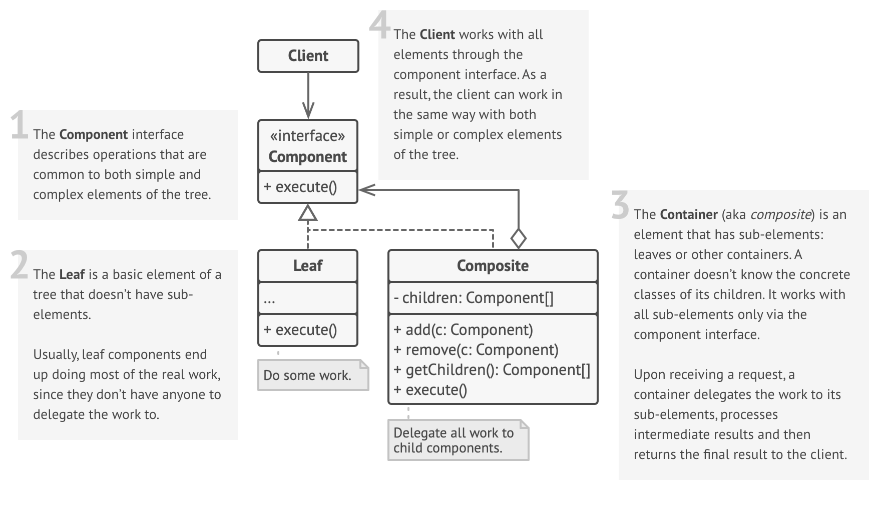

# Composite Design Pattern

## Definition

📁 Imagine you are organizing files on your computer. You have two types of things to manage:

- **Files** 📄 (e.g., document.pdf, image.jpg) — These are individual items.
- **Folders** 📁 (or directories) — These are containers that can hold both files and other folders.

Now, think about an operation like "calculate size". You can calculate the size of a single file. You can also calculate the size of a folder, which is the sum of the sizes of everything inside it—all the files and all the sub-folders.

You can treat both the file and the folder in a uniform way; you can ask either one for its size. This ability to treat a single object (a file) and a group of objects (a folder) in the exact same way is the essence of the Composite Pattern.

Relating to the pattern:

- **The concept of a 'thing on your disk that has a name and a size'** → Component Interface
- **A single file** → Leaf (an individual, indivisible object)
- **A folder that can contain other items** → Composite (an object that holds a collection of other components)
- **You, using the file explorer to view sizes or move items** → Client

The **Composite Pattern** is a structural design pattern that lets you compose objects into tree structures to represent part-whole hierarchies. Composite lets clients treat individual objects and compositions of objects uniformly.

## Structure



### Main Components

- **Component** — This is the common interface (or abstract class) for all objects in the composition, both simple (leaves) and complex (composites). It declares the operations that are common to all parts, such as `get_size()` or `display()`.
- **Leaf** — Represents the individual, end-objects of the composition. A Leaf has no children. It implements the operations defined in the Component interface (e.g., a File knows its own size).
- **Composite** — Represents the complex objects that can have children (other Leaves or Composites). It stores its child components and implements the operations from the Component interface, typically by delegating the work to its children and then aggregating the results (e.g., a Folder's size is the sum of its children's sizes).
- **Client** — Interacts with all objects in the composition through the single Component interface. Because of this uniform interface, the client code doesn't need to differentiate between simple leaf objects and complex composite objects.

## Key Characteristics

**Represents Part-Whole Hierarchies** 🌳

- Its primary purpose is to model tree-like structures where an object can be a whole made up of smaller parts.  
**Benefit:** Provides a natural way to represent nested structures like file systems, GUI hierarchies, or organizational charts.

**Uniformity and Transparency** ✨

- The client can treat individual objects and groups of objects in the same way.  
**Benefit:** Simplifies client code immensely. The client doesn't need if/else statements or type-checking to handle different kinds of objects in the tree.

**Recursive Composition** 🔄

- Composites can contain other Composites, which allows for the creation of deeply nested and complex tree structures.  
**Benefit:** Allows for arbitrary complexity and depth in the hierarchy.

**Simplified Client Code** 🧑‍💻

- Because the client interacts with all objects via a common interface, the code becomes much simpler and more general.  
**Benefit:** Easier to write, read, and maintain code that manipulates the tree structure.

## When to Use?

✅ **When you need to represent a part-whole hierarchy of objects.**  
**Example:** Organizational structures, file systems, or nested GUI components.

✅ **When you want client code to treat individual objects and compositions of objects uniformly.**  
**Example:** Simplifies the client and decouples it from the specific classes that implement the hierarchy.

✅ **When the structure is recursive and can have arbitrary depth and complexity.**  
**Example:** The pattern handles nesting gracefully.

✅ **To make it easier to add new kinds of components.**  
**Example:** New Leaf or Composite classes can be introduced, and as long as they adhere to the Component interface, the client code will work with them without any changes.

## When NOT to Use?

❌ **When your system doesn't have a clear part-whole hierarchy.**  
If your objects are just a flat collection, a simple list or set is more appropriate.

❌ **When you want the type system to enforce a strong distinction between simple objects (leaves) and containers (composites).**  
The pattern's main benefit is treating them the same, which can be a drawback if you want them to be treated differently.

❌ **When the common interface becomes too 'fat'.**  
Sometimes, to achieve uniformity, methods that only make sense for Composites (like `add_child()`) are added to the main Component interface. This forces Leaves to provide empty or exception-throwing implementations, which can be awkward.

❌ **When the hierarchy is very simple and not expected to change.**  
For a simple, fixed two-level tree, the overhead of creating a formal component/leaf/composite structure might be unnecessary.

## Code Example

```python
from abc import ABC, abstractmethod
from typing import List

# Component Interface
class FileSystemComponent(ABC):
    def __init__(self, name: str):
        self.name = name

    @abstractmethod
    def get_size(self) -> int:
        # Returns size in kilobytes
        pass

# Leaf
class File(FileSystemComponent):
    def __init__(self, name: str, size: int):
        super().__init__(name)
        self._size = size

    def get_size(self) -> int:
        print(f"'{self.name}' file size: {self._size}KB")
        return self._size

# Composite
class Folder(FileSystemComponent):
    def __init__(self, name: str):
        super().__init__(name)
        self._children: List[FileSystemComponent] = []

    def add(self, component: FileSystemComponent):
        self._children.append(component)

    def get_size(self) -> int:
        total_size = 0
        print(f"\nCalculating size for folder '{self.name}':")
        for child in self._children:
            total_size += child.get_size()
        print(f"-> Total for folder '{self.name}': {total_size}KB")
        return total_size

# --- Client Code ---
if __name__ == "__main__":
    # Create individual files (Leaves)
    file1 = File("report.pdf", 150)
    file2 = File("image.jpg", 500)
    file3 = File("archive.zip", 2048)

    # Create folders (Composites)
    root_folder = Folder("My Documents")
    pictures_folder = Folder("Pictures")

    # Build the tree structure
    pictures_folder.add(file2)
    root_folder.add(file1)
    root_folder.add(pictures_folder)
    root_folder.add(file3)

    # The client calls get_size() on the top-level folder.
    # It doesn't need to know what's inside (files, folders, etc.).
    print("\n--- Getting total size of the root folder ---")
    total_system_size = root_folder.get_size()
    print(f"\nFinal calculated size of '{root_folder.name}': {total_system_size}KB")
```

## Real World Examples

- **Graphic User Interfaces (GUI)** 🖼️  
  - **Component:** A generic `VisualComponent` with methods like `draw()` and `handle_event()`.  
  - **Leaf:** Basic widgets like `Button`, `Label`, `TextBox`.  
  - **Composite:** Container widgets like `Panel`, `Window`, `Form` which can hold other components (both leaves and other composites).  
  - **Client:** The application's rendering engine.  
  - **Flow:** To draw the entire window, the engine simply calls `window.draw()`. The window's `draw()` method then recursively calls `draw()` on all its children (panels, buttons, etc.) until the entire UI tree is rendered.

- **Product Kits in E-commerce** 📦  
  - **Component:** An `OrderableItem` with a `get_price()` method.  
  - **Leaf:** An individual `Product` (e.g., a mouse, a keyboard).  
  - **Composite:** A `ProductKit` or `Bundle` (e.g., a "Gaming Starter Pack" box).  
  - **Client:** The shopping cart or checkout system.  
  - **Flow:** When the client calculates the total price, it calls `get_price()` on each item in the cart. If an item is a bundle (composite), its `get_price()` method calculates its price by summing the prices of all the individual products it contains.

- **XML/HTML Document Object Model (DOM)** 🌐  
  - **Component:** The `Node` interface.  
  - **Leaf:** `TextNode` (contains only text and no children).  
  - **Composite:** `ElementNode` (like `<div>`, `<p>`) which can contain other nodes (both text nodes and other element nodes).  
  - **Client:** A web browser or an XML parser.  
  - **Flow:** The client can perform operations like searching for text or applying a style to any `Node`. If the operation is performed on an `ElementNode` (composite), it often propagates down to all its children.

- **Organizational Hierarchies** 🏢  
  - **Component:** An `Employee` interface with a `get_salary()` method.  
  - **Leaf:** An `IndividualContributor` who has a salary but no direct reports.  
  - **Composite:** A `Manager` who has a salary and a list of employees they manage.  
  - **Client:** The HR or finance department's reporting software.  
  - **Flow:** To calculate the total salary cost of a department, the client calls `get_salary()` on the department head (a `Manager`). The manager's `get_salary()` method returns its own salary plus the sum of the results of calling `get_salary()` on all its reports.

- **Multi-level Menus in Applications** 📜  
  - **Component:** `MenuComponent` with a `display()` method.  
  - **Leaf:** `MenuItem` (e.g., "Save", "Print"), which is a final, clickable action.  
  - **Composite:** `SubMenu` (e.g., "File", "Edit"), which contains a list of other `MenuComponents`.  
  - **Client:** The application's main menu bar renderer.  
  - **Flow:** To display the "File" menu, the renderer calls `display()` on the "File" `SubMenu` object, which in turn calls `display()` on its children ("New", "Open", "Save", etc.).

- **Financial Instruments** 💰  
  - **Component:** `FinancialInstrument` with a `get_market_value()` method.  
  - **Leaf:** An individual `Stock`, `Bond`, or `Option`.  
  - **Composite:** A `Portfolio` which can contain a mix of individual instruments and other sub-portfolios.  
  - **Client:** A financial dashboard or risk assessment tool.  
  - **Flow:** To get the total value of a client's holdings, the tool calls `get_market_value()` on their main portfolio. The portfolio recursively calculates its value by summing the market values of all assets it contains.

- **Abstract Syntax Trees (AST) in Compilers** 🌳  
  - **Component:** An `ASTNode` with a `generate_code()` method.  
  - **Leaf:** Nodes representing literals or variables (e.g., `NumberNode`, `VariableNode`).  
  - **Composite:** Nodes representing operations (e.g., `AdditionNode`, `FunctionCallNode`) which have other nodes as children (the operands).  
  - **Client:** The code generation stage of a compiler.  
  - **Flow:** To generate machine code for a function, the client calls `generate_code()` on the root node of the function's AST. An `AdditionNode`, for example, would recursively call `generate_code()` on its children (the left and right operands) and then emit an "ADD" instruction.

- **Graphic Shapes in Drawing Applications** 🎨  
  - **Component:** A `Shape` interface with a `draw()` method.  
  - **Leaf:** Simple shapes like `Circle`, `Line`, `Square`.  
  - **Composite:** A `Group` object which can contain a collection of other shapes, including other groups.  
  - **Client:** The canvas rendering engine.  
  - **Flow:** The user can group several shapes together. The client can then treat this group as a single object, calling `draw()` on the group. The group's `draw()` method simply iterates through its children and calls `draw()` on each of them.
