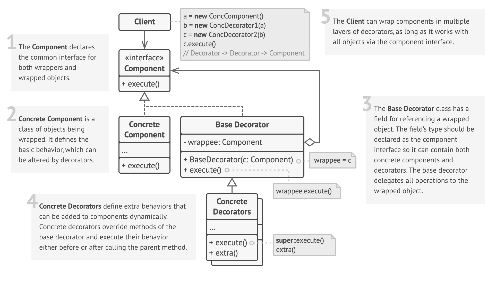

# Decorator Design Pattern

## Definition

☕️ Imagine you walk into a coffee shop. The basis for many drinks is a simple, plain cup of coffee. This is your **core object**.

Now, you want to customize it. You can ask the barista to:

- Add milk 🥛 (*a Decorator*)
- Add sugar ✨ (*another Decorator*)
- Add a dollop of whipped cream ☁️ (*a third Decorator*)
- Maybe a dash of caramel syrup 🍮 (*a fourth Decorator*)

Each of these "add-ons" is a **decorator**. They wrap the original coffee (and any previous add-ons) and enhance it by adding new flavor and increasing the cost. You can combine them in any way you like. A "latte with whipped cream" is just a `WhippedCream` decorator wrapping a `Milk` decorator which wraps a `SimpleCoffee` object. Crucially, from the outside, it's still treated as a "beverage" with a price and a description.

Relating to the pattern:

- **The simple, plain coffee** → ConcreteComponent (the base object)
- **The concept of a "beverage" that has a cost and description** → Component Interface
- **Milk, Sugar, Whipped Cream add-ons** → ConcreteDecorators
- **You, the customer ordering the final creation** → Client

The **Decorator Pattern** is a structural design pattern that lets you attach new behaviors to objects by placing these objects inside special wrapper objects that contain the behaviors. It provides a flexible alternative to subclassing for extending functionality.

## Structure



### Main Components

- **Component** — The common interface for both the objects being wrapped and the decorators themselves. It declares the operations that can be altered by decorators.
- **ConcreteComponent** — The original, base class that we want to decorate. It implements the Component interface.
- **Base Decorator** — An abstract class that also implements the Component interface. It holds a reference to a wrapped Component object and delegates calls to it. This class defines the common wrapping interface for all concrete decorators.
- **ConcreteDecorator** — A class that extends the Base Decorator. It adds its own specific functionality (its "decoration") either before or after delegating the call to the wrapped object. Multiple decorators can be stacked on top of one another.
- **Client** — The code that uses the Component interface to interact with both ConcreteComponents and Decorators. It can treat decorated objects as if they were the original component.

## Key Characteristics

**Alternative to Static Subclassing** 🧑‍🎨

- Provides a flexible way to add functionality without creating a massive number of subclasses for every possible combination (avoids "class explosion").  
**Benefit:** You don't need a `CoffeeWithMilk` class, a `CoffeeWithSugar` class, a `CoffeeWithMilkAndSugar` class, etc.

**Wraps Objects** 🎁

- Decorators act as wrappers that "contain" the component they are decorating. They are often called "wrappers."  
**Benefit:** This allows responsibilities to be added to an object without modifying its code.

**Uniform Interface** 🧩

- Decorators and the objects they wrap share a common interface.  
**Benefit:** From a client's perspective, a decorated object is indistinguishable from an undecorated one. You can use them interchangeably.

**Dynamic and Transparent** ✨

- Responsibilities can be added to (and sometimes removed from) objects at runtime, simply by wrapping them in a different set of decorators.  
**Benefit:** Offers great flexibility in composing object behaviors dynamically.

## When to Use?

✅ **To add responsibilities to individual objects dynamically, without affecting other objects of the same class**  
**Example:** Adding a special border to a single UI component without changing the base class or other components.

✅ **When creating many subclasses to support all possible feature combinations is impractical**  
**Example**: If you have 4 optional features, you'd need 2⁴ = 16 subclasses. With decorators, you only need 4 decorator classes.

✅ **When you cannot extend a class using inheritance**  
**Example**: If the class is marked as `final` (in Java/C#) or comes from a third-party library you can't modify, Decorator is a perfect way to add functionality.

✅ **When you want to be able to remove responsibilities from an object**  
**Example:** While not always straightforward, you can design your decorators to be "unwrapped" to revert to a previous state.

## When NOT to Use?

❌ **When you only need to add a few simple, static responsibilities**  
If you only have one or two variations that never change, simple subclassing might be easier to implement and understand.

❌ **When client code relies on an object's concrete type**  
Decorators hide the original ConcreteComponent from the client. If your client code uses `instanceof` checks to behave differently based on the concrete class, the pattern might break that logic.

❌ **In performance-critical situations where many layers of decorators are needed**  
While usually negligible, the indirection from many small decorator objects can have a performance impact compared to a single, monolithic object.

❌ **When the setup logic for creating decorated objects becomes too complex**  
Instantiating a component with many layers of decorators (e.g., `new A(new B(new C(object)))`) can be cumbersome. This is often solved by using a Factory or Builder pattern to hide the complex construction.

## Code Example

```python
from abc import ABC, abstractmethod

# Component Interface
class Coffee(ABC):
    @abstractmethod
    def get_cost(self) -> float:
        pass

    @abstractmethod
    def get_description(self) -> str:
        pass

# ConcreteComponent
class SimpleCoffee(Coffee):
    def get_cost(self) -> float:
        return 2.00

    def get_description(self) -> str:
        return "Simple Coffee"

# Base Decorator
class CoffeeDecorator(Coffee):
    def __init__(self, coffee: Coffee):
        self._decorated_coffee = coffee

    def get_cost(self) -> float:
        return self._decorated_coffee.get_cost()

    def get_description(self) -> str:
        return self._decorated_coffee.get_description()

# ConcreteDecorators
class MilkDecorator(CoffeeDecorator):
    def get_cost(self) -> float:
        return super().get_cost() + 0.50

    def get_description(self) -> str:
        return super().get_description() + ", with Milk"

class SugarDecorator(CoffeeDecorator):
    def get_cost(self) -> float:
        return super().get_cost() + 0.25

    def get_description(self) -> str:
        return super().get_description() + ", with Sugar"

# --- Client Code ---
if __name__ == "__main__":
    my_coffee = SimpleCoffee()
    print(f"Order: {my_coffee.get_description()} | Cost: ${my_coffee.get_cost():.2f}")

    # Now, let's decorate it!
    my_coffee_with_milk = MilkDecorator(my_coffee)
    print(f"Order: {my_coffee_with_milk.get_description()} | Cost: ${my_coffee_with_milk.get_cost():.2f}")

    # Let's decorate it further
    my_fancy_coffee = SugarDecorator(my_coffee_with_milk)
    print(f"Order: {my_fancy_coffee.get_description()} | Cost: ${my_fancy_coffee.get_cost():.2f}")

    # Or create a different one from scratch
    sweet_latte = SugarDecorator(MilkDecorator(SimpleCoffee()))
    print(f"Order: {sweet_latte.get_description()} | Cost: ${sweet_latte.get_cost():.2f}")
```

## Real World Examples

- **Java I/O Streams (java.io package)** 📜  
  - **Component:** `InputStream`.  
  - **ConcreteComponent:** `FileInputStream` (reads raw bytes from a file).  
  - **Decorators:** `BufferedInputStream` (adds buffering for performance), `GZIPInputStream` (adds decompression), `ObjectInputStream` (adds object serialization).  
  - **Flow:** You can wrap a `FileInputStream` with a `BufferedInputStream` to make file reading more efficient, like so: `new BufferedInputStream(new FileInputStream("file.txt"))`. Each wrapper adds functionality while conforming to the `InputStream` interface.

- **Styling UI Components (e.g., in a GUI framework)** 🖼️  
  - **Component:** A generic `VisualComponent` interface with a `draw()` method.  
  - **ConcreteComponent:** A `TextView` or `Button`.  
  - **Decorators:** `BorderDecorator` (adds a border when drawing), `ScrollbarDecorator` (adds scrollbars), `ShadowDecorator` (adds a drop shadow).  
  - **Flow:** To create a scrollable text view with a border, you could instantiate it as `new BorderDecorator(new ScrollbarDecorator(new TextView()))`. The final `draw()` call would trigger the drawing of the border, then the scrollbars, then the text view itself.

- **Data Compression and Encryption Streams** 🔐  
  - **Component:** A generic `DataStream` interface with `read()` and `write()` methods.  
  - **ConcreteComponent:** A `FileStream` or `NetworkStream` that writes raw data.  
  - **Decorators:** `CompressionDecorator`, `EncryptionDecorator`.  
  - **Flow:** To send compressed and encrypted data over the network, you would wrap your stream like this: `new EncryptionDecorator(new CompressionDecorator(new NetworkStream()))`. When you write data, it first gets compressed, then the compressed data gets encrypted, and finally the encrypted data is sent over the network.

- **Web Framework Middleware (e.g., Express.js, ASP.NET Core)** 🌐  
  - **Component:** The core request handler that ultimately processes the request.  
  - **ConcreteComponent:** The final route handler function that returns a response.  
  - **Decorators:** Each piece of middleware (e.g., for logging, authentication, CORS, compression).  
  - **Flow:** An incoming HTTP request is passed through a pipeline of middleware decorators. The logging middleware logs the request and then passes it to the authentication middleware, which checks credentials and passes it to the next, and so on, until it reaches the final handler.

- **Adding Features to a Notification Service** 📣  
  - **Component:** `INotifier` interface with a `send(message)` method.  
  - **ConcreteComponent:** `EmailNotifier` (sends a basic email).  
  - **Decorators:** `SmsDecorator`, `PushNotificationDecorator`, `SlackDecorator`.  
  - **Flow:** If a high-priority alert needs to be sent via email, SMS, and Slack, you can assemble the notifier object on the fly: `new SlackDecorator(new SmsDecorator(new EmailNotifier()))`. Calling `send()` on the outermost object triggers all three notification types.

- **Caching Layers for Data Access** 🗄️  
  - **Component:** A `Repository` interface with a `get_data(id)` method.  
  - **ConcreteComponent:** `DatabaseRepository` that fetches data directly from a database.  
  - **Decorator:** `CacheRepositoryDecorator`.  
  - **Flow:** The client code interacts with the `Repository` interface. You wrap the `DatabaseRepository` with the `CacheRepositoryDecorator`. When `get_data(id)` is called, the cache decorator first checks if the data is in the cache. If yes, it returns it. If not, it calls the wrapped `DatabaseRepository`'s `get_data()` method, stores the result in the cache, and then returns it.

- **Logging and Metrics for Method Calls** 📊  
  - **Component:** A service interface, e.g., `IPaymentService`.  
  - **ConcreteComponent:** `RealPaymentService` that processes payments.  
  - **Decorators:** `LoggingDecorator`, `MetricsDecorator`.  
  - **Flow:** You wrap your service: `new MetricsDecorator(new LoggingDecorator(new RealPaymentService()))`. When a method is called, the `MetricsDecorator` starts a timer, calls the wrapped `LoggingDecorator`, which logs the method call and its arguments, which in turn calls the actual payment service. On return, the logging decorator logs the outcome, and the metrics decorator stops the timer and records the duration.

- **Transactional Behavior** 🏦  
  - **Component:** A `DataCommand` interface with an `execute()` method.  
  - **ConcreteComponent:** A command that performs a database write, like `UpdateUserCommand`.  
  - **Decorator:** `TransactionalDecorator`.  
  - **Flow:** You wrap your command object: `new TransactionalDecorator(new UpdateUserCommand())`. When `execute()` is called on the decorator, it first starts a database transaction, then calls the wrapped command's `execute()` method. If the inner command succeeds, the decorator commits the transaction; if it fails, it rolls back the transaction.
