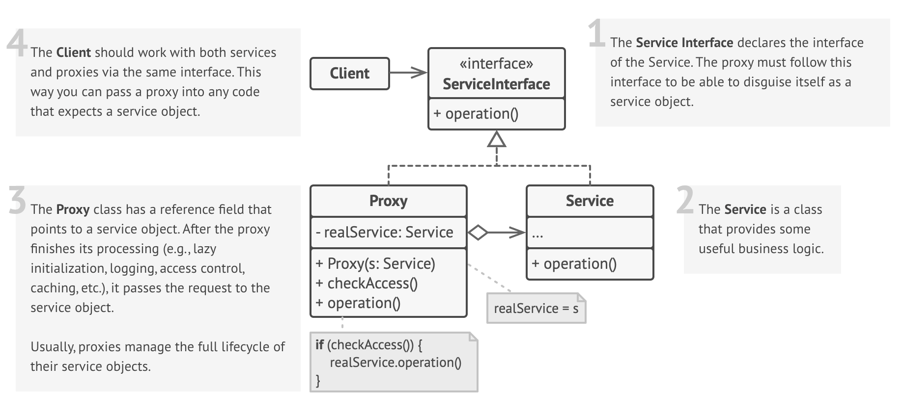

# Proxy Design Pattern

## Definition

💳 Imagine your bank account. The actual, physical money and the complex ledger system at the bank are the real object. Carrying all that cash around or directly interacting with the bank's ledger for every small transaction would be impractical and insecure.

Instead, you use a credit card. Your credit card is a **Proxy** for your bank account.

- It has the same interface for making payments as cash (`pay()`).
- It's lightweight and easy to carry.
- It controls access to your funds by requiring a PIN or signature.
- It adds functionality like logging transactions, fraud detection, and loyalty points.
- It only interacts with the real bank system when a transaction actually occurs.

Relating to the pattern:

- **Your bank account with its funds and ledger** → RealService (the actual, heavyweight, or sensitive object)
- **The concept of making a payment** → Service Interface
- **Your credit card** → Proxy (a surrogate that provides the same interface but controls access and adds behavior)
- **You, making a purchase** → Client

The **Proxy Pattern** is a structural design pattern that provides a surrogate or placeholder for another object to control access to it. It allows you to perform actions either before or after the request gets to the original object without the client knowing.

## Structure



### Main Components

- **Service Interface** — This is a common interface that both the RealService and the Proxy implement. This is crucial as it allows the Client to treat the Proxy exactly as it would the RealService.
- **RealService** — This is the actual object that does the real work. It often contains resource-intensive or sensitive logic that we want to manage through a proxy.
- **Proxy** — This class implements the Service interface and holds a reference to an instance of the RealService. It can manage the lifecycle of the RealService (e.g., creating it on demand) and can perform additional tasks before or after delegating a request to it.
- **Client** — Interacts with the object through the Service interface. The client code works with either the Proxy or the RealService without needing to know the difference.

## Key Characteristics & Types of Proxies

**Access Control** 🔐

- The proxy can check permissions before forwarding a request to the RealService.
**Benefit:** Useful for implementing security measures, like ensuring only authorized users can access certain methods.

**Lazy Initialization** 💤

- The proxy creates the RealService only when it’s needed.
**Benefit:** Saves resources by delaying the creation of expensive objects until they are actually needed.

**Remote Proxy** 🌐

- Acts as a local representative for an object that lives in a different address space (e.g., on another machine).
**Benefit:** Simplifies communication with remote objects, making them appear local.

**Virtual Proxy** 🖼️

- Represents a complex object that is expensive to create. It loads the real object only on demand.
**Benefit:** Improves performance by loading resources only when necessary.

**Logging & Monitoring** 📜

- The proxy can log requests, monitor usage, or count method invocations.
**Benefit:** Provides insights into system behavior and usage patterns.

**Caching Proxy** 🗄

- Caches the results of expensive operations to speed up future requests.
**Benefit:** Reduces latency and improves performance by avoiding repeated calculations.
️

## When to Use?

✅ **For lazy initialization (Virtual Proxy)**  
**Example**: When you have a large object that is expensive to create, like a high-resolution image or a complex report, and you want to delay its creation until it is actually needed.

✅ **To implement access control (Protection Proxy)**  
**Example**: When different clients should have different access rights to an object. For example, an admin user can call `delete_user()`, but a regular user cannot.

✅ **To represent an object in a remote location (Remote Proxy)**  
**Example**: This is the foundation of many distributed systems technologies like gRPC and CORBA, where you call methods on a local object that transparently executes them on a remote server.

✅ **To add supplementary logic like caching or logging (Caching/Logging Proxy)**  
**Example**: When you need to add cross-cutting concerns to a class without modifying its source code. This aligns with the Single Responsibility Principle.

## When NOT to Use?

❌ **When the system is simple and requires no indirect access**  
If there's no need for lazy loading, access control, or other proxy features, adding one introduces unnecessary complexity.

❌ **When the client needs direct, uncontrolled access to the real object**  
If the proxy's control logic gets in the way of legitimate client use cases, it might be the wrong pattern.

❌ **In extremely performance-critical code where the indirection matters**  
The extra hop through the proxy object adds a small amount of overhead. While negligible in 99% of cases, it might be a factor in high-frequency trading or low-level graphics rendering.

❌ **When your object's logic and its access control logic are tightly coupled and will never change**  
If the access rules are simple and intrinsic to the object's function, putting them directly in the class might be simpler than creating a separate proxy.

## Code Example

```python
import time
from abc import ABC, abstractmethod

# Subject Interface
class Image(ABC):
    @abstractmethod
    def display(self):
        pass

# RealService
class HighResolutionImage(Image):
    def __init__(self, filepath: str):
        # This simulates a heavyweight operation: loading a large file from disk
        self._filepath = filepath
        print(f"Loading high-resolution image from {self._filepath}...")
        time.sleep(2) # Simulate delay
        print("Image loaded.")

    def display(self):
        print(f"Displaying image: {self._filepath}")

# Proxy
class ImageProxy(Image):
    def __init__(self, filepath: str):
        self._filepath = filepath
        self._real_image: HighResolutionImage = None # The real object is not created yet

    def display(self):
        # The RealService is created only when it's actually needed (lazy loading)
        if self._real_image is None:
            print("Proxy: Creating real image object now...")
            self._real_image = HighResolutionImage(self._filepath)
        # Now, delegate the call to the real object
        self._real_image.display()

# --- Client Code ---
if __name__ == "__main__":
    # Note: Creating proxies is fast because the real images are not loaded yet.
    print("Creating image proxies...")
    img1 = ImageProxy("photo1.jpg")
    img2 = ImageProxy("photo2.png")
    print("Proxies created. Real images not yet loaded.")

    print("\n--- Client requests to display the first image ---")
    # The real HighResolutionImage object for img1 is created here, on first use.
    img1.display()

    print("\n--- Client requests to display the first image again ---")
    # This time, the real object already exists, so it's much faster.
    img1.display()

    print("\n--- Client requests to display the second image ---")
    # The real HighResolutionImage object for img2 is created here.
    img2.display()
```

## Real World Examples

- **ORM Lazy Loading (Virtual Proxy)** 📚  
  - **Proxy Type:** Virtual Proxy.  
  - **Client:** Your application code that accesses a user's list of posts (`user.posts`).  
  - **Subject Interface:** A List or Collection interface.  
  - **RealService:** The actual, large collection of Post objects, which would require an expensive database query to load.  
  - **Proxy:** A special proxy collection object returned by the ORM.  
  - **Flow:** When you load a User object, the `user.posts` attribute is a proxy object, not the real list. No database query is made. The moment your code tries to access an element from `user.posts` (e.g., `for post in user.posts:`), the proxy executes the database query to fetch the posts and then delegates the iteration to the real collection.

- **Access Control for User Roles (Protection Proxy)** 🛡️  
  - **Proxy Type:** Protection Proxy.  
  - **Client:** A user interacting with the system UI.  
  - **Subject Interface:** An `IDocumentService` with methods like `view_document()` and `delete_document()`.  
  - **RealService:** A `DocumentService` that performs the actual file operations.  
  - **Proxy:** A `DocumentServiceProxy` that wraps the real service.  
  - **Flow:** When a user tries to call `delete_document()`, the proxy first checks the user's role from their session. If the user is an 'Admin', it forwards the call to the RealService. If the user is a 'Guest', it denies the request and throws an "Access Denied" error.

- **API Gateways (Multiple Proxy Types)** 🛰️  
  - **Proxy Type:** Remote, Protection, Logging, and Caching Proxy combined.  
  - **Client:** A front-end application (web or mobile).  
  - **Subject Interface:** The public API endpoints (e.g., `/api/users/{id}`).  
  - **RealService:** The various internal microservices (User Service, Order Service, etc.).  
  - **Proxy:** The API Gateway itself.  
  - **Flow:** The client sends a request to the API Gateway. The gateway (proxy) logs the request, checks the authentication token (protection), forwards the request to the appropriate microservice (remote), and might cache the response before returning it to the client.

- **Caching Server Responses (Caching Proxy)** 🗄️  
  - **Proxy Type:** Caching Proxy.  
  - **Client:** A web browser or mobile application.  
  - **Subject Interface:** A data fetching interface.  
  - **RealService:** A service that performs an expensive database query or calculation.  
  - **Proxy:** A `CachingProxyService`.  
  - **Flow:** The client calls `proxy.get_report(month='May')`. The proxy first creates a cache key (e.g., "report_May") and checks its cache (like Redis). If the report is found, it returns the cached data instantly. If not, it calls the RealService to generate the report, stores the result in the cache, and then returns it to the client.

- **Calling Remote Services (gRPC/SOAP) (Remote Proxy)** 📡  
  - **Proxy Type:** Remote Proxy.  
  - **Client:** A local application service.  
  - **Subject Interface:** A locally generated interface (`IWeatherService`) that mirrors the remote service's methods.  
  - **RealService:** The actual `WeatherService` object running on a completely different server.  
  - **Proxy:** A client-side "stub" object generated by the gRPC/SOAP framework.  
  - **Flow:** The client calls `weather_stub.get_forecast("London")` on the local stub object. The stub (proxy) handles serializing the request, sending it over the network to the remote server, waiting for the response, and deserializing it back into a local object for the client. All network complexity is hidden.

- **C++ Smart Pointers (`std::shared_ptr`)** 🧠  
  - **Proxy Type:** A proxy that manages object lifecycle.  
  - **Client:** C++ code using the smart pointer.  
  - **Subject Interface:** The pointer-like interface (`*` and `->` operators).  
  - **RealService:** The raw object allocated on the heap.  
  - **Proxy:** The `std::shared_ptr` object itself.  
  - **Flow:** The smart pointer acts as a proxy to the raw object. It overloads operators to behave like a regular pointer, but it also contains extra logic: a reference counter. When the last `shared_ptr` proxying the object is destroyed, it automatically deletes the RealService, preventing memory leaks.

- **Transactional Proxies** 🏦  
  - **Proxy Type:** A proxy that adds behavior.  
  - **Client:** A high-level business logic service.  
  - **Subject Interface:** An interface for data operations, e.g., `IAccountService`.  
  - **RealService:** The service that executes the raw database UPDATE commands.  
  - **Proxy:** A `TransactionalAccountServiceProxy`.  
  - **Flow:** The client calls `proxy.transfer_funds(...)`. The proxy first starts a database transaction, then calls the RealService's `transfer_funds` method (which might involve multiple UPDATE statements). If the real method succeeds, the proxy commits the transaction. If it throws an exception, the proxy catches it and rolls back the transaction, ensuring data integrity.

- **Image Thumbnails (Virtual Proxy)** 🖼️  
  - **Proxy Type:** Virtual Proxy.  
  - **Client:** A file explorer or web gallery UI.  
  - **Subject Interface:** An `IImage` interface.  
  - **RealService:** The full, high-resolution image file on disk.  
  - **Proxy:** A lightweight `ThumbnailProxy` object.  
  - **Flow:** When displaying a folder of 100 images, the UI creates 100 lightweight `ThumbnailProxy` objects. These proxies show a small, low-resolution thumbnail immediately. Only when the user double-clicks a thumbnail to view it full-screen does that specific proxy load the heavyweight RealService (the full image) into memory.
