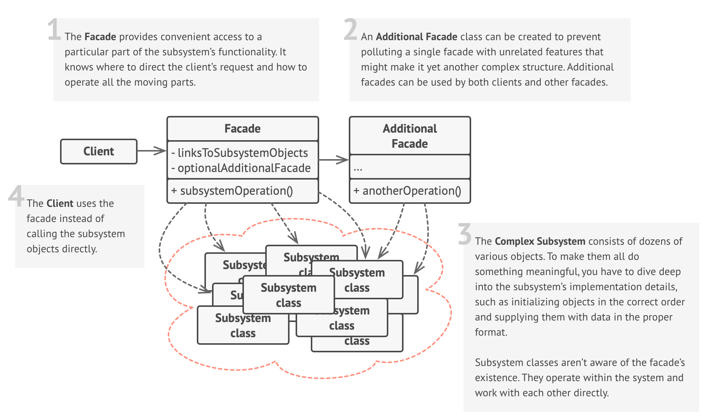

# Facade Design Pattern

## Definition

Imagine you have a sophisticated home theater system with the following components:

- **TV** 📺
- **Blu-ray player** 📀
- **Sound system** (amplifier + speakers) 🔊
- **Projector**
- **Smart lighting** 💡

To watch a movie, you'd normally need to:

1. Turn on the TV and set the input.
2. Turn on the Blu-ray player.
3. Turn on the sound system and select the right input.
4. Lower the projector screen (if applicable).
5. Dim the lights.

That's a lot of steps and remotes! 😫

Now, imagine a single "Movie Mode" button on a universal remote or a smart home panel. You press it, and voila! ✨ Everything is set up perfectly for your movie night. This "Movie Mode" button acts as a **Facade**.

Relating to the Pattern:

- You (the user) → **Client**
- "Movie Mode" button → **Facade**
- TV, Blu-ray player, Sound System, Lights, Projector → **Complex Subsystem**
- Pressing "Movie Mode" → Client making a simple request to the Facade
- The Facade coordinating all devices → Facade delegating tasks to the Subsystem

The **Facade Pattern** is a structural design pattern that provides a simplified, higher-level interface to a complex subsystem of classes, libraries, or frameworks. Instead of making clients interact with numerous complex objects directly, the Facade offers a single, unified entry point.

## Structure



### Main Components

- **Facade**: This is the class that provides the simplified interface. It knows which subsystem classes are responsible for a request and delegates client requests to the appropriate subsystem objects. It might perform additional logic before or after forwarding a request.

- **Additional Facade classes (optional)**: Sometimes, you might have multiple Facade classes for different subsystems or functionalities. Each Facade can provide a different interface to the same subsystem.

- **Subsystem classes (or Components)**: These are the classes that implement the complex functionality of the system. They do the actual work. Subsystem classes have no knowledge of the Facade; they operate independently and can be used directly by clients who need more fine-grained control.

- **Client**: Uses the Facade to interact with the subsystem, rather than interacting with the numerous subsystem classes directly.

## Key Characteristics

**Simplified Interface** 🎯

- Provides a simpler, higher-level way to use a complex system.  
**Benefit**: Makes the subsystem easier to use and understand for most common tasks.

**Decoupling**  🔗

- Decouples clients from the internal components of a subsystem. Clients interact with the Facade, not the intricate details of the subsystem.  
**Benefit**: Changes to the subsystem's internal workings (e.g., replacing components, refactoring) are less likely to affect clients as long as the Facade's interface remains stable.

**Reduces Complexity**  🧩

- Hides the complexity of interacting with multiple subsystem components.  
**Benefit**: Clients don't need to know about the interdependencies or the order of operations within the subsystem.

**Promotes Subsystem Layering**  🧱

- Can be used to structure a system into layers. Facades can provide entry points to each level.  
**Benefit**: Improves maintainability and allows for independent development of layers.

**Optional Direct Access** 🚪

- While the Facade provides a simple interface, it usually doesn't prevent clients from accessing the underlying subsystem classes directly if they need more advanced functionality or fine-grained control.  
**Benefit**: Offers flexibility – simplicity for common cases, power for advanced ones.

## When to Use?

✅ **Provide a simple interface to a complex subsystem.**  
**Example**: When a system has many interdependent classes or a confusing API, and clients only need a subset of the functionality for common tasks.

✅ **Decouple a subsystem from its clients and other subsystems.**  
**Example**: To make the subsystem easier to evolve independently and reduce compilation dependencies.

✅ **Layer your subsystems.**  
**Example**: Use Facades to define entry points to each layer in a multi-layered architecture. This helps enforce layer separation.

✅ **Wrap a poorly designed or legacy API.**  
**Example**: Create a cleaner, more modern Facade around an old, clunky set of APIs without rewriting the old code.

## **When NOT to Use?**

❌ **The subsystem is already simple.**  
Adding a Facade to a simple system just adds unnecessary indirection and complexity.

❌ **Clients almost always need fine-grained control over the subsystem.**  
If the simplified interface of the Facade is rarely used, and clients mostly bypass it to access subsystem components directly, the Facade might not be providing much value.

❌ **Performance is absolutely critical for every interaction.**  
The extra layer of indirection introduced by the Facade has a minor performance cost. In most cases, this is negligible, but in extremely performance-sensitive scenarios, it might be a consideration.

❌ **Over-simplification leads to loss of essential features.**  
If the Facade hides too much and doesn't allow for necessary customizations or access (even as an option), it might be too restrictive.

## Code Example

```python
# Subsystem classes
class DVDPlayer:
    def on(self):
        print("DVD Player ON")

    def play(self, movie):
        print(f"Playing movie: {movie}")

class Projector:
    def on(self):
        print("Projector ON")

    def wide_screen_mode(self):
        print("Projector in widescreen mode")

class SoundSystem:
    def on(self):
        print("Sound System ON")

    def set_volume(self, level):
        print(f"Sound volume set to {level}")

# Facade
class HomeTheaterFacade:
    def __init__(self, dvd, projector, sound):
        self.dvd = dvd
        self.projector = projector
        self.sound = sound

    def watch_movie(self, movie):
        print("Get ready to watch a movie...")
        self.dvd.on()
        self.projector.on()
        self.projector.wide_screen_mode()
        self.sound.on()
        self.sound.set_volume(10)
        self.dvd.play(movie)

# Client code
dvd = DVDPlayer()
projector = Projector()
sound = SoundSystem()

home_theater = HomeTheaterFacade(dvd, projector, sound)
home_theater.watch_movie("Inception")
```

## Real World Examples

- **Customer Service Helpdesk** 📞💬
  - **Client**: Customer with an issue.
  - **Facade**: A single customer service phone number or online portal.
  - **Subsystem**: Billing department, technical support, sales department, logistics.
  - **Flow**: The customer explains their issue to the facade, which then routes the request to the appropriate internal department without the customer needing to know the internal structure.

- **E-commerce Checkout** 🛒💳
  - **Client**: Online shopper.
  - **Facade**: A single checkout page.
  - **Subsystem**: Shopping cart, payment gateway, inventory management.
  - **Flow**: The shopper adds items to their cart, proceeds to checkout, and completes their purchase without needing to know the internal workings of the system.

- **Starting a Car with an Ignition Key 🔑🚗**
  - **Client**: Driver.
  - **Facade**: The ignition key/start button.
  - **Subsystem**: Engine control unit, fuel injection system, starter motor, electrical system, spark plugs.
  - **Flow**: Turning the key initiates a complex sequence of operations in the subsystem, all hidden from the driver.

- **Smart Home Systems** 🏠📱
  - **Client**: Homeowner.
  - **Facade**: A single app or interface.
  - **Subsystem**: Smart lights, thermostat, security cameras, door locks.
  - **Flow**: The homeowner controls all smart devices from a single app, without needing to know the internal workings of each device.

- **Game Development** 🎮
  - **Client**: Game developer.
  - **Facade**: A game engine or framework.
  - **Subsystem**: Graphics rendering, physics simulation, input handling, audio management.
  - **Flow**: The developer uses the facade to interact with various subsystems, simplifying the process of game development.

- **A Compiler for a Programming Language 💻⚙️**
  - **Client**: Developer writing code.
  - **Facade**: The main compiler command (e.g., gcc main.c -o main).
  - **Subsystem**: Lexer (tokenizer), parser, semantic analyzer, optimizer, code generator.
  - **Flow**: The developer issues a single compile command, and the facade manages the complex pipeline of compilation stages.

- **Libraries like requests in Python for HTTP 🌐**
  - **Client**: Developer needing to make an HTTP request.
  - **Facade**: requests.get(), requests.post().
  - **Subsystem**: Lower-level socket programming, connection management, handling different HTTP methods, headers, cookies, SSL/TLS.
  - **Flow**: The developer uses a simple requests.get("url") call, and the library handles all the underlying network complexity.

- **Database Access Libraries** 🗄️
  - **Client**: Developer needing to interact with a database.
  - **Facade**: A simplified interface for database operations (e.g., ORM).
  - **Subsystem**: Database connection management, query building, result mapping.
  - **Flow**: The developer uses the facade to perform database operations without needing to know the underlying complexity.
